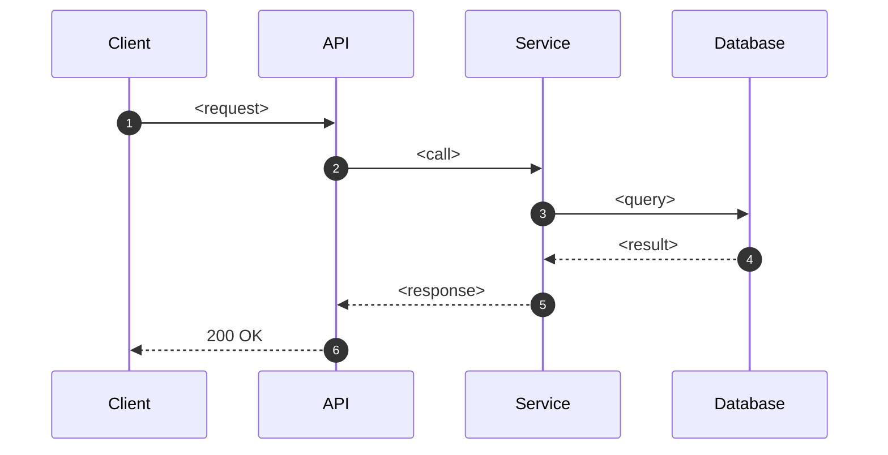
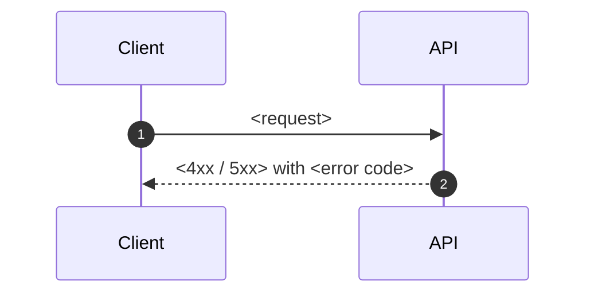

# Sequence — <flow name>

<!-- One file per flow. Cover happy + 1-2 error paths. -->

## Happy path

```mermaid
sequenceDiagram
    autonumber
    participant C as Client
    participant API as API
    participant SVC as Service
    participant DB as Database

    C->>API: <request>
    API->>SVC: <call>
    SVC->>DB: <query>
    DB-->>SVC: <result>
    SVC-->>API: <response>
    API-->>C: 200 OK
```

## Error path: <name>

```mermaid
sequenceDiagram
    autonumber
    participant C as Client
    participant API as API

    C->>API: <request>
    API-->>C: <4xx / 5xx> with <error code>
```