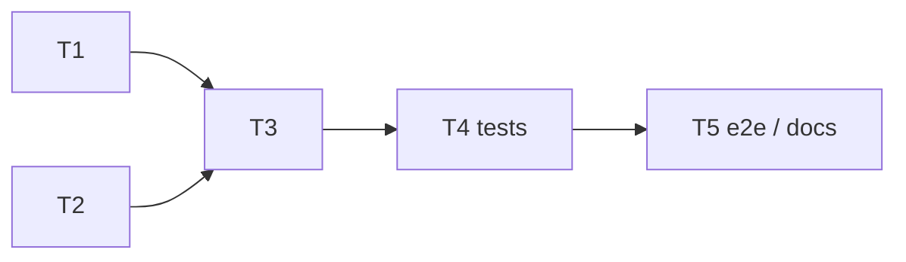

# Task divide — <feature>

<!-- Stage 08 → see skills/divide-tasks/SKILL.md -->

## Upstream artefacts

- PRD: [../PRD.md](../PRD.md) — <AC range, NFR §>
- SAD: [../sad.md](../sad.md) — <§5 building blocks, §6 runtime sequences, §9 ADR index, §10 quality requirements>
- ADR-NNNN (Accepted): [../adr/NNNN-<title>.md](../adr/NNNN-<title>.md)
- Data model (if any): [../data-model.md](../data-model.md) — <entities touched>
- API contract (if any): [../contracts/openapi.yaml](../contracts/openapi.yaml) — <N endpoints>

<!-- If an upstream artefact leaves an open architectural decision unresolved (SAD §11 / PRD §8
     "resolve before implementation"), add an "## Open-decision handling" or
     "## Open-decision resolution" section here — resolve it for task-divide purposes (spike task,
     or a documented choice with rationale + accepted risk), don't silently ignore it. See prior
     runs (forgot-password, theme-toggle) for the shape. -->

## Dependency graph

## Tasks

| ID | Title | DoR | DoD | Deps | Estimate | Owner |
|----|-------|-----|-----|------|----------|-------|
| T1 | [<action verb + object>](./<task-slug>.md) | <precondition> | PR merged, <one-line check> | — | S | <name> |
| T2 | [<...>](./<task-slug>.md) | <...> | <...> | — | M | <name> |
| T3 | [<...>](./<task-slug>.md) | T1, T2 done | <...> | T1, T2 | S | <name> |
| T4 | [Unit/integration tests: <what, QG-N if any>](./<task-slug>.md) | T3 done | tests green, covers <AC/QG> | T3 | S | <name> |
| T5 | [E2E: <happy path>](./<task-slug>.md) | <client/server tasks> done | e2e green | <...> | S | <name> |

<!-- IMPORTANT: filenames are descriptive kebab-case slugs, NOT "t1-...", "t2-..." — the task ID
     (T1, T2, ...) lives only in this table, in tracker.md, and in each story file's own H1
     heading ("# T4 — <title>"). Never put the ID in the filename. See existing
     docs/features/{forgot-password,theme-toggle}/tasks/*.md for real examples: e.g.
     require-auth-tokenversion.md, client-forgot-password-form.md, integration-test-*.md,
     unit-tests-*.md, e2e-*.md — named after WHAT the task does, not its number. -->

## Estimation legend

- XS: ≤2h
- S: ≤1d
- M: 1-2d (borderline — consider splitting)
- L: must be split, ≤1d did not work out

## Notes

<!-- Anything that shapes the breakdown but doesn't fit the table: effort-budget cross-check
     against idea-brief/SAD sizing, tasks intentionally NOT created (and why — e.g. no migration
     task because the schema already shipped in stage 06), a skipped task-ID number with the
     reason it was folded elsewhere, parallelization notes (e.g. "client tasks only depend on the
     frozen contract, not on backend tasks landing first"). -->
