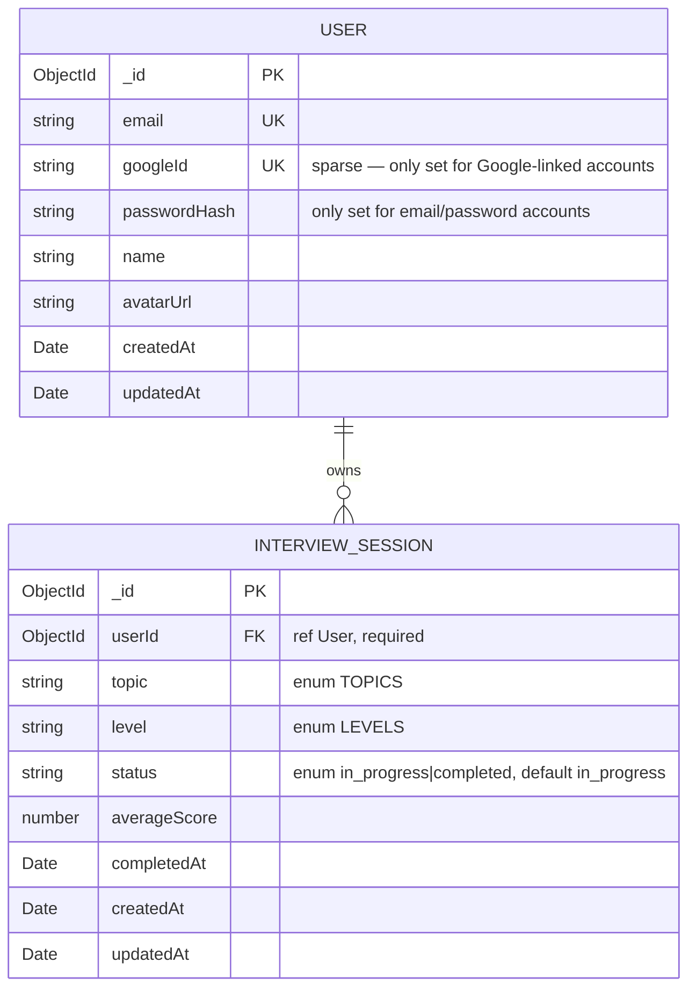

# Data model — AI Interview Trainer (project level)

> Persistence profile: **no-migration-tool** (MongoDB via Mongoose; no migration runner adopted —
> see `docs/adr/0001-initial-setup.md` and `.claude/rules/migrations.md`). This document is a
> retrofit: it describes the schema as already shipped in `src/models/`, not a pre-build plan.
> Types are expressed in Mongoose terms; see `generate-data-model`'s SKILL.md Defaults table for
> the equivalent in another profile.

## ER diagram

`InterviewSession.questions` is an embedded array of `QuestionAttempt` sub-documents (`_id: false`
— no independent identity, no separate collection) — not shown as its own ER box because it has
no existence outside its parent session. Documented under Entities below.

## Entities

### `User` (`src/models/User.ts`)

| Field | Type | Constraints | Notes |
|---|---|---|---|
| `_id` | ObjectId | PK, Mongo-native | Project's established identifier convention — kept, not overridden with an app-generated id |
| `email` | String | required, unique | Login identifier for both auth methods |
| `googleId` | String | unique, sparse | Only present for Google-OAuth accounts; sparse so multiple email/password users (no `googleId`) don't collide on `null` |
| `passwordHash` | String | optional | `bcryptjs` hash; only present for email/password accounts — never the raw password (PRD §6.1) |
| `name` | String | required | |
| `avatarUrl` | String | optional | Google-provided avatar; absent for email/password accounts |
| `createdAt` | Date | required, `{ timestamps: true }` | |
| `updatedAt` | Date | required, `{ timestamps: true }` | Deliberate deviation from this skill's "createdAt-only" default — already shipped via Mongoose's `timestamps: true` shorthand; see `.claude/rules/migrations.md` |

**Access patterns:**
- Login by email → implicit unique index on `email`.
- Google OAuth lookup/link → implicit unique+sparse index on `googleId`.

**Constraints:** UNIQUE on `email`; UNIQUE+SPARSE on `googleId`.

### `InterviewSession` (`src/models/InterviewSession.ts`)

| Field | Type | Constraints | Notes |
|---|---|---|---|
| `_id` | ObjectId | PK, Mongo-native | |
| `userId` | ObjectId | required, `ref: 'User'` | Every controller query filters by this field (ownership filtering, PRD AC-05) — see Indexes below |
| `topic` | String | required, `enum: TOPICS` (9 values, `src/models/InterviewSession.ts`) | Duplicated by hand in `client/src/types/interview.ts` — see Drift findings |
| `level` | String | required, `enum: LEVELS` (junior/middle/senior) | Same duplication as `topic` |
| `questions` | [QuestionAttempt] (embedded) | default `[]` | See sub-schema below; embedded because no cross-session query needs it split into its own collection (matches ADR-0001's stated reason for choosing Mongo: shape changes more often than a rigid relational schema would allow at this stage) |
| `averageScore` | Number | optional | Set once the session completes |
| `status` | String | `enum: ['in_progress', 'completed']`, default `in_progress` | Domain invariant (project PRD AC-04): once `completed`, no further answer may be appended — enforced in `submitAnswer`, not at the schema layer (correct per "DB as dumb storage") |
| `completedAt` | Date | optional | Set on completion; used to sort/filter history |
| `createdAt` | Date | required, `{ timestamps: true }` | |
| `updatedAt` | Date | required, `{ timestamps: true }` | Same deliberate deviation as `User.updatedAt` |

**Embedded sub-schema `QuestionAttempt`** (`_id: false` — no independent identity):

| Field | Type | Constraints | Notes |
|---|---|---|---|
| `question` | String | required | |
| `answer` | String | required | |
| `score` | Number | required, `min: 0, max: 10` | |
| `feedback` | String | required | |
| `correctAnswer` | String | required | Must be persisted by `submitAnswer` on every write — see `.claude/rules/backend/data-model.md` for the specific past bug this guards against |
| `weakTopics` | [String] | default `[]` | |

**Access patterns:**
- `getActiveSession`: `{ userId, status: 'in_progress' }`, sorted by `createdAt` desc → index candidate.
- `getHistory`: `{ userId, status: 'completed' }` (+ optional `topic`/`level`), sorted by `completedAt` desc → same index candidate.
- `getStats`: `{ userId, status: 'completed' }` → same index candidate.
- `getSessionDetail` / `submitAnswer`: `{ _id, userId }` → served by the default `_id` index; `userId` here is an ownership check, not a scan predicate, so no extra index needed.

**Constraints:** `userId` references `User._id` (`ref: 'User'`), not enforced at the DB layer (Mongoose has no FK constraint) — ownership is enforced in every controller query instead (PRD AC-05, §6.1).

## Indexes

| Index | Fields | Query it serves | Status |
|---|---|---|---|
| `email_1` | `email` | Login by email; uniqueness | Existing (implicit from `unique: true`) |
| `googleId_1` | `googleId` | Google OAuth lookup/link; uniqueness | Existing (implicit from `unique: true, sparse: true`) |
| `userId_1_status_1` | `userId, status` | `getActiveSession`, `getHistory`, `getStats` — every `InterviewSessionModel` query in the codebase filters by exactly this pair (`src/controllers/{interview,history,stats}.controller.ts`) | Added 2026-09-07 — see Schema-change log |

## Schema-change log

### 2026-09-07 — add userId+status index on InterviewSession

- **Change:** added `interviewSessionSchema.index({ userId: 1, status: 1 })` in
  `src/models/InterviewSession.ts`. Justified by three existing query patterns
  (`getActiveSession`, `getHistory`, `getStats` — see Access patterns above), all of which
  filter by exactly this pair and previously ran as unindexed collection scans.
- **Backfill:** none needed — an index build requires no data migration; MongoDB builds it
  from existing documents automatically on deploy.
- **Rollback:** `db.interviewsessions.dropIndex({ userId: 1, status: 1 })`, or remove the
  `.index()` call from `InterviewSession.ts` and let it drop on the next deploy that runs
  Mongoose's index sync (`autoIndex`, or `syncIndexes()` if the project adopts it later).

## Test fixtures

No dedicated test-fixture factory module exists yet (`npm run test` runs `vitest` — check
`src/**/*.test.ts` for inline fixtures if adding new tests that need `User`/`InterviewSession`
instances).
