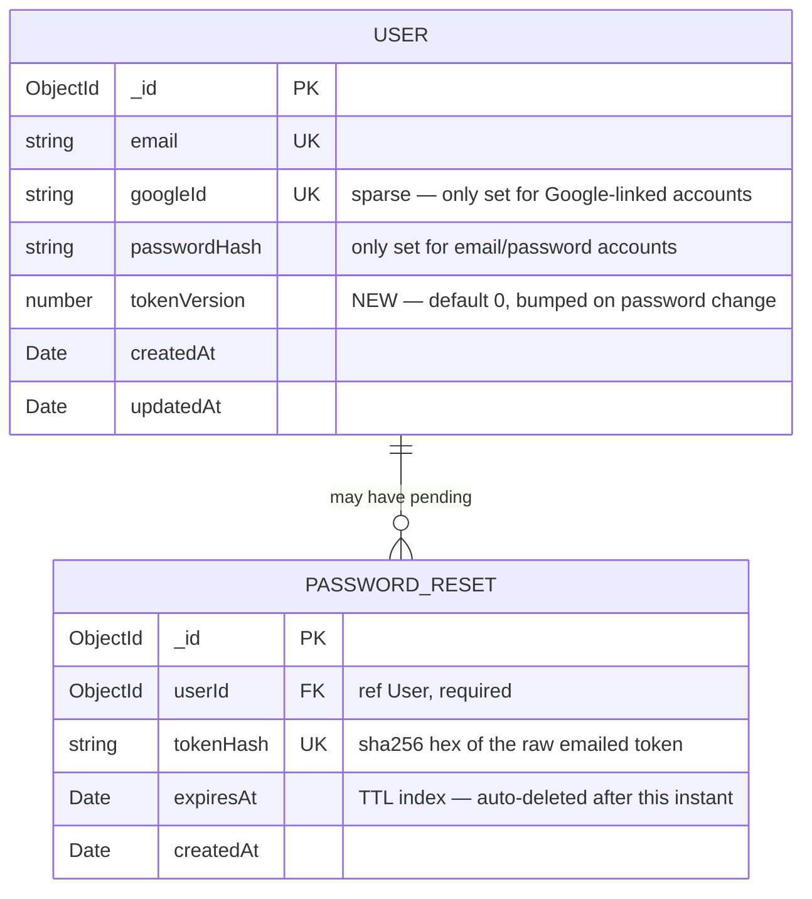

# Data model — Forgot / Reset / Change Password

> Persistence profile: **no-migration-tool** (MongoDB via Mongoose; no migration runner adopted —
> see `docs/adr/0001-initial-setup.md` and `.claude/rules/migrations.md`, confirmed unchanged by
> this feature). This document describes the intended schema change as a **plan** — the actual
> `src/models/*.ts` edits are deferred to implementation time, per this pass being documentation
> only. Types are expressed in Mongoose terms; see `generate-data-model`'s SKILL.md Defaults table
> for the equivalent in another profile.

## ER diagram

`PasswordReset` is a new, separate collection (not embedded in `User`) — see
[ADR-0001](./adr/0001-store-reset-tokens-in-a-separate-collection.md) for the rationale (decouples
per-attempt token churn from the `User` document, and lets a MongoDB TTL index garbage-collect
expired attempts with no application cleanup job).

## Entities

### `User` (`src/models/User.ts`) — existing entity, one new field

| Field | Type | Constraints | Notes |
|---|---|---|---|
| `_id` | ObjectId | PK, Mongo-native | Existing — unchanged |
| `email` | String | required, unique | Existing — unchanged |
| `googleId` | String | unique, sparse | Existing — unchanged |
| `passwordHash` | String | optional | Existing — unchanged |
| `tokenVersion` | Number | **NEW** — required, default `0` | Incremented by 1 every time the password changes (via reset or change-password); `requireAuth` compares it against the JWT's embedded value to invalidate all previously issued sessions at once (PRD AC-06, [ADR-0002](./adr/0002-tokenversion-counter-for-session-invalidation.md)). Default `0` is a genuine identity default (counter starting point), not a business-state default — permitted per `.claude/rules/migrations.md`. |
| `createdAt` | Date | required, `{ timestamps: true }` | Existing — unchanged |
| `updatedAt` | Date | required, `{ timestamps: true }` | Existing — unchanged |

**Access patterns:** unchanged — `tokenVersion` is read as part of the existing by-`_id` lookup in
`requireAuth`, not a new query shape.

**Constraints:** no new constraint. `tokenVersion` is a plain required-with-default field, not a
uniqueness or reference target.

**Zero-downtime rollout** (`.claude/rules/migrations.md` pattern for a new required field): add
as optional with a schema `default: 0` first — Mongoose applies the default to every document read
back regardless of whether it exists in storage yet, so no explicit backfill script is needed for
existing `User` documents. This is the "genuinely additive, no guard needed" case the profile's
Defaults table describes, not the add→backfill→enforce 3-step (that 3-step is for fields that must
be *validated* as present, which `tokenVersion` never needs to be — a missing value and `0` are
behaviorally identical).

### `PasswordReset` (`src/models/PasswordReset.ts`) — new collection

| Field | Type | Constraints | Notes |
|---|---|---|---|
| `_id` | ObjectId | PK, Mongo-native | Project's established identifier convention |
| `userId` | ObjectId | required, `ref: 'User'` | The account this reset attempt belongs to |
| `tokenHash` | String | required, unique, `maxlength: 64` | SHA-256 hex digest of the raw token emailed to the job-seeker — never store the raw token (same "hash, don't store the secret" discipline as `User.passwordHash`) |
| `expiresAt` | Date | required | Set to issuance time + 15 minutes (PRD §6 NFR: token validity window ≤ 15 min) |
| `createdAt` | Date | required, default = now, immutable | `createdAt`-only per this skill's default — no `updatedAt`: a `PasswordReset` document is never mutated after creation, only read (to verify) and then deleted (to consume) |

**Single-use enforcement (deliberately no `used`/`consumed` boolean field):** consuming a token
is an atomic `findOneAndDelete({ tokenHash })` in `passwordReset.service.ts` (SAD §5) — the
document either exists (first use, succeeds) or doesn't (already used or expired, fails). This
avoids a `used: true` field, which would be exactly the kind of business-state
`default`/mutation the schema-layer rules forbid (`.claude/rules/migrations.md`) — the *absence*
of the document is the single-use signal, not a flag on it.

**Access patterns:**
- Confirm-reset lookup: `{ tokenHash }` → index `tokenHash_1` (also serves the uniqueness
  constraint).
- Invalidate outstanding attempts when a new reset is requested for the same account: `{ userId }`
  → index `userId_1`.
- Expiry cleanup: MongoDB TTL index on `expiresAt` (`expireAfterSeconds: 0`) — the store deletes
  the document once `expiresAt` passes, with no application-level cleanup job.

**Constraints:** UNIQUE on `tokenHash`; `userId` references `User._id` (`ref: 'User'`), not
enforced at the DB layer (Mongoose has no FK constraint) — ownership is enforced in
`passwordReset.service.ts`, matching the existing `InterviewSession.userId` convention
(root `docs/data-model.md`).

## Indexes

| Index | Fields | Query it serves | Status |
|---|---|---|---|
| `tokenHash_1` | `tokenHash` | Confirm-reset lookup by the emailed token's hash; uniqueness | Planned — new |
| `userId_1` | `userId` | Invalidate/count outstanding reset attempts for an account when a new one is requested | Planned — new |
| `expiresAt_1` (TTL) | `expiresAt`, `expireAfterSeconds: 0` | Automatic expiry cleanup — no cron/cleanup job needed | Planned — new |

<!-- Rate-limiting (PRD §6 NFR: ≤3 reset requests/hour/email) is an app-level counter concern, not
     a new persisted field or entity — it can be served by counting existing PasswordReset
     documents for a userId within the last hour via the userId_1 index above, for registered
     emails. For unregistered emails (AC-02 hides existence, so no PasswordReset document is
     created at all), rate-limiting needs a separate mechanism (e.g. a short-lived in-memory or
     IP-based counter) — flagged as an open implementation question, not a schema gap. -->

## Schema-change log

### 2026-09-09 — add tokenVersion to User

- **Change:** add `tokenVersion: { type: Number, required: true, default: 0 }` to
  `src/models/User.ts`. Justified by PRD AC-06 (password change must invalidate all other active
  sessions) and [ADR-0002](./adr/0002-tokenversion-counter-for-session-invalidation.md).
- **Backfill:** none needed — Mongoose applies the schema `default: 0` to every document read
  back, including ones written before this field existed; no existing `User` document needs to be
  rewritten for the default to take effect.
- **Rollback:** remove the `tokenVersion` field definition from `User.ts`, and remove the
  corresponding check from `src/middleware/auth.ts`'s `requireAuth`. Existing documents keep the
  stray field until they're next saved without it (harmless — Mongoose ignores schema fields not
  read by the application) or are cleaned up with a one-off
  `db.users.updateMany({}, { $unset: { tokenVersion: "" } })` if a fully clean rollback is wanted.

### 2026-09-09 — create PasswordReset collection

- **Change:** create `src/models/PasswordReset.ts` (fields: `userId`, `tokenHash`, `expiresAt`,
  `createdAt`) with the three indexes listed above. Justified by PRD AC-01/AC-02/AC-03 and
  [ADR-0001](./adr/0001-store-reset-tokens-in-a-separate-collection.md).
- **Backfill:** none needed — a brand-new, empty collection.
- **Rollback:** delete `src/models/PasswordReset.ts` and drop the collection
  (`db.passwordresets.drop()`). Safe at any time — the collection holds only short-lived,
  in-flight reset attempts, never durable account state.

## Test fixtures

No dedicated test-fixture factory module exists yet in this project (`npm run test` runs
`vitest` — see root `docs/data-model.md`). When tests are added for this feature, colocate
`PasswordReset` fixtures alongside however `User` test instances are already constructed in
`src/**/*.test.ts`, per the existing (currently inline, not factory-based) convention. PII guard:
any seeded/fixture email must use the `example.test` domain, never a real-looking address
(`.claude/rules/migrations.md`).
