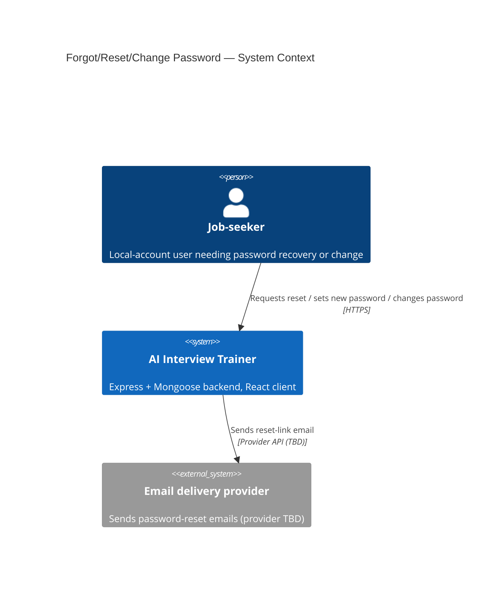
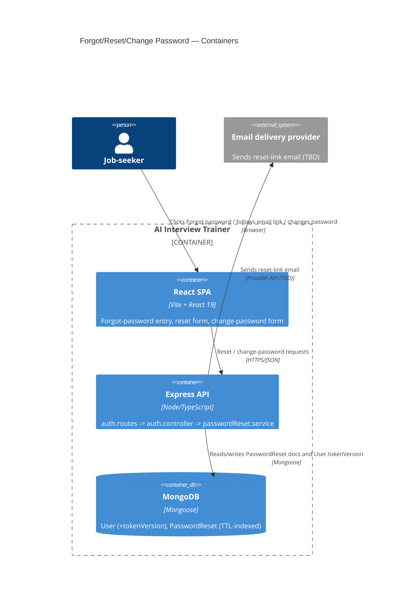
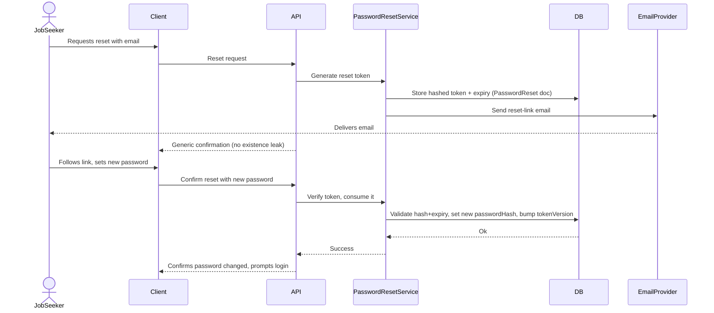
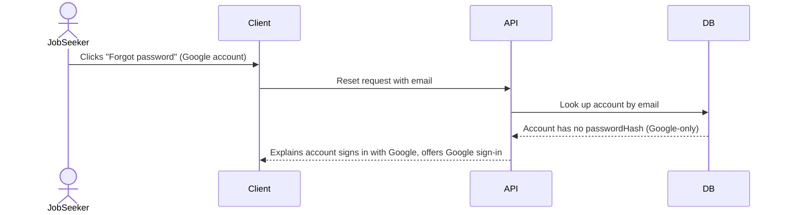

# Software Architecture Document — Forgot / Reset / Change Password

<!-- Generated by the architecture-design skill — see its SKILL.md for the 8-step protocol. -->
<!-- 12 Arc42 sections. C4 Context (L1) lives inline in §3. C4 Container (L2) lives inline in §5. -->

## 1. Introduction and goals

**Intent.** A job-seeker with a Local account (email+password) who forgot their password
recovers access on their own, without contacting support; the same job-seeker can change their
password anytime while logged in. A job-seeker with a Google OAuth account who lands in this flow
by mistake gets a clear explanation instead of a dead end (PRD §2 Goals).

**Top-3 quality goals (1-liners; full scenarios in §10):**

1. Security of the reset mechanism — tokens are single-use, short-lived (≤15 min), and
   rate-limited (≤3/hour/email); no response ever reveals whether an email is registered.
2. Correctness under compromise — a password change must end every other active session
   immediately (closes idea-brief §10's top risk).
3. Clarity for the Google-account edge case — no dead ends; the system always explains why reset
   doesn't apply and offers a way forward.

**Stakeholders.**

| Role | Interest | Sign-off owner? |
|---|---|---|
| Job-seeker | Uses the feature to regain or update account access | No |
| Architect/Tech Lead | Approves this SAD, owns the trade-offs recorded in it | Yes |

## 2. Constraints

**Technical.**
- TypeScript 5.7, Node/Express 4.21 (ESM), Mongoose 8.9 on MongoDB — backend (`src/`).
- Vite + React 19 + TypeScript — client (`client/`), independently typed, no shared package.
- Layered backend convention: `routes → controllers → services → models`, dependencies flow down
  only (ADR-0001 at project root, `docs/sad.md` §5/§8).
- Auth libs already in use: `bcryptjs`, `jsonwebtoken`, `google-auth-library`, `cookie-parser`.
- New external dependency introduced by this feature: an email-delivery provider (selection TBD,
  §11 Open architectural decision).

**Organisational.**
- Effort budget: ~4 person-weeks (idea-brief §11 Effort signal).
- No hard deadline — "nice to have" (idea-brief §4).
- Single maintainer (Tanya) — solo project, no formal review board.

**Conventions.**
- Models are dumb storage — no business-rule validation or business-decision defaults at the
  schema layer (`.claude/rules/migrations.md`).
- Zero-downtime schema-change pattern: add optional field → backfill if needed → flip to required
  only if ever needed; every schema change gets a dated entry in `docs/data-model.md`'s
  Schema-change log with a rollback procedure in prose (`.claude/rules/migrations.md`).
- Identifier strategy: MongoDB native `_id` (ObjectId) throughout — no app-generated UUIDs
  (`.claude/rules/migrations.md`).
- No dev-login bypass may be reintroduced (`.claude/rules/backend/auth.md`).

**Regulatory / external.**
- Data classification: Internal (PRD §6.1) — job-seeker personal data, no regulated category.
- No GDPR/PCI/SOC2 applicability identified for this feature.

## 3. Context and scope

A job-seeker who cannot log in (forgot their password) or wants to update their credentials
interacts with the existing Express+Mongoose backend and the Vite+React client. This feature
introduces one new external dependency: an email-delivery provider to send reset-link emails
(provider itself is an open decision — PRD §8, tracked as an Open architectural decision in §11
below).

**External systems (in / out):**

| Actor or system | Type | Interaction |
|---|---|---|
| Job-seeker | Person | Requests a reset, follows the emailed link, sets or changes a password |
| Email delivery provider | System (external) | Sends the password-reset-link email (provider TBD) |

**C4 Context (L1):**



## 4. Solution strategy

**Top-3 strategic choices (the seeds for ADRs):**

1. **Reset tokens live in a separate `PasswordReset` collection, not on `User`** — keeps
   per-attempt token churn (issue, expire, single-use consume) fully decoupled from the `User`
   document, and lets a MongoDB TTL index on `expiresAt` garbage-collect expired attempts for
   free. See [ADR-0001](./adr/0001-store-reset-tokens-in-a-separate-collection.md).
2. **Session invalidation via a `tokenVersion` counter on `User`, checked in `requireAuth`** —
   since sessions are stateless JWTs with no server-side store, this is the minimal mechanism that
   satisfies PRD AC-06 (ending all other sessions on password change) without introducing new
   infrastructure (no Redis, no revocation-list collection). See
   [ADR-0002](./adr/0002-tokenversion-counter-for-session-invalidation.md).
3. **Email delivery is a pluggable service boundary, provider deferred** — a new
   `passwordReset.service.ts` owns "send a reset email" behind one function signature, so the
   provider choice (still an open PRD §8 question) can be resolved later without touching
   controllers. Not itself ADR-worthy — no alternative is being foreclosed yet; tracked as an
   Open architectural decision in §11.

Each tactical decision in later sections traces back to one of these three seeds.

## 5. Building block view

The feature follows the existing layered convention (`routes → controllers → services → models`)
with no new architectural style introduced.

**Internal decomposition (server, `src/`):**

```
src/
├── routes/auth.routes.ts            <adds 3 routes: request-reset, confirm-reset, change-password>
├── controllers/auth.controller.ts   <adds 3 handlers, following the existing issueSession pattern>
├── services/passwordReset.service.ts  <new: token generation/verification, email-send delegation>
├── models/PasswordReset.ts          <new collection: tokenHash, userId ref, expiresAt (TTL index)>
├── models/User.ts                   <adds tokenVersion: Number, default 0>
└── middleware/auth.ts               <requireAuth extended: compares JWT's tokenVersion claim
                                       against User.tokenVersion, rejects on mismatch>
```

**C4 Container (L2):**



## 6. Runtime view

**Critical flow 1: Forgot/reset happy path (AC-01, AC-06)**



**Critical flow 2: Google-account edge case (AC-05)**



## 7. Deployment view

<!-- N/A: feature reuses the existing deployment unit — no new infra unit, no new replicas. -->

The feature ships inside the existing Express process and MongoDB instance; no new deployment
unit is introduced. The only new external touchpoint is outbound calls to an email-delivery
provider (provider TBD, §11) — this adds a new required environment variable (name TBD) alongside
the existing `ANTHROPIC_API_KEY`, `GOOGLE_CLIENT_ID`, `JWT_SECRET`, `CLIENT_URL`
(`.claude/rules/backend/overview.md`).

**Monitoring:**
- No APM/metrics exist yet for this project (root PRD §6) — this feature does not change that
  baseline; monitoring the email provider's delivery/bounce rate is deferred until a provider is
  chosen (§11).

**Scaling thresholds:**
- N/A — current scale (single maintainer, no measured load) does not warrant a threshold
  discussion for a single new collection with a TTL index.

## 8. Crosscutting concepts

| Concept | Convention | Where defined |
|---|---|---|
| Authentication | JWT via httpOnly cookie, extended with a `tokenVersion` check | `src/middleware/auth.ts`, [ADR-0002](./adr/0002-tokenversion-counter-for-session-invalidation.md) |
| Error handling | Same `res.status(...).json({ error })` pattern as existing auth routes | `src/controllers/auth.controller.ts` |
| ID strategy | MongoDB native `_id` (ObjectId), no new ID scheme | `.claude/rules/migrations.md` |
| Schema-change logging | Every field/collection addition logged in `docs/data-model.md` with rollback prose | `.claude/rules/migrations.md` |
| Internationalisation | N/A — English only, matches root PRD | — |
| Observability | N/A — no APM exists yet (root PRD §6) | — |

## 9. Architecture decisions

| # | Title | Status | Section |
|---|---|---|---|
| 0001 | Store password-reset tokens in a separate PasswordReset collection | Accepted | §4, §5 |
| 0002 | Use a tokenVersion counter on User for session invalidation on password change | Accepted | §4, §5, §6 |

ADR files live under `docs/features/forgot-password/adr/NNNN-<title>.md`.

## 10. Quality requirements

**QG-1. Security of the reset mechanism**
- **When:** a job-seeker requests or confirms a password reset.
- **Then:** the token is hashed at rest, valid for ≤15 minutes, single-use, and reset requests
  are rate-limited to ≤3/hour per email (PRD §6 NFR, verbatim).
- **How verify:** unit tests for token-consume-once behavior and the rate-limit threshold.

**QG-2. Correctness under compromise**
- **When:** a job-seeker's password change completes (via reset or via change-password).
- **Then:** every other active session for that job-seeker becomes invalid immediately (PRD
  AC-06).
- **How verify:** integration test — issue N (≥2) sessions for one account, change the password
  via one of them, and assert that all remaining sessions' JWTs are rejected by `requireAuth` on
  their next request (not just one, matching AC-06's "every other active session").

**QG-3. Clarity for the Google-account edge case**
- **When:** a job-seeker whose account has no `passwordHash` (Google-only) opens forgot-password
  or change-password.
- **Then:** the system always responds with the explicit Google-account explanation, never a
  generic error (PRD AC-05).
- **How verify:** integration test asserting the specific response path for accounts with no
  `passwordHash`.

**QG-4. Change-password error handling**
- **When:** a logged-in job-seeker attempts to change their password but supplies an incorrect
  current password.
- **Then:** the system blocks the change, tells the job-seeker their current password is
  incorrect, and leaves the existing password unchanged (PRD AC-04).
- **How verify:** integration test asserting a wrong current-password attempt is rejected and the
  stored `passwordHash` is unchanged afterward.

## 11. Risks and technical debt

| Risk / debt | Severity | Mitigation | Owner |
|---|---|---|---|
| Building the first-ever email integration is nontrivial scope beyond token/hash logic | Medium | Isolated behind `passwordReset.service.ts`'s single send-email function; provider choice deferred, not blocking the rest of the design | Tanya |
| `tokenVersion` check adds one DB read to every authenticated request (see ADR-0002 Negative) | Low | Acceptable at current scale (single Mongo instance, no measured load per root PRD §6); revisit if latency ever becomes measurable | Tanya |
| Open architectural decision: which email-delivery provider to integrate | Open question | Resolve before implementation starts — PRD §8 already tracks this with owner Tanya, due before implementation; carried forward here since still unresolved | Tanya |

**Accepted debt (acceptable in v1, plan to fix later):**
- No secondary recovery factor (SMS, security questions) — accepted per idea-brief §5 non-goal;
  revisit only if real abuse patterns emerge.
- `tokenVersion` invalidates ALL of a job-seeker's sessions together — no per-device ("log out
  this device only") granularity; accepted per ADR-0002's Negative consequence.

## 12. Glossary

| Term | Meaning |
|---|---|
| Local account | (root: `docs/features/forgot-password/CONTEXT.md`) A job-seeker account registered via email+password, with its own password. NOT Google OAuth account. |
| Password reset token | (root: `docs/CONTEXT.md`) A one-time, time-limited token proving ownership of an email address, used to authorize setting a new password. NOT session auth token. |
| tokenVersion | An integer counter on `User`, incremented on every password change; `requireAuth` compares it against the value embedded in the JWT at issuance and rejects the request on mismatch — the mechanism that invalidates all previously issued sessions at once (PRD AC-06, [ADR-0002](./adr/0002-tokenversion-counter-for-session-invalidation.md)). |
