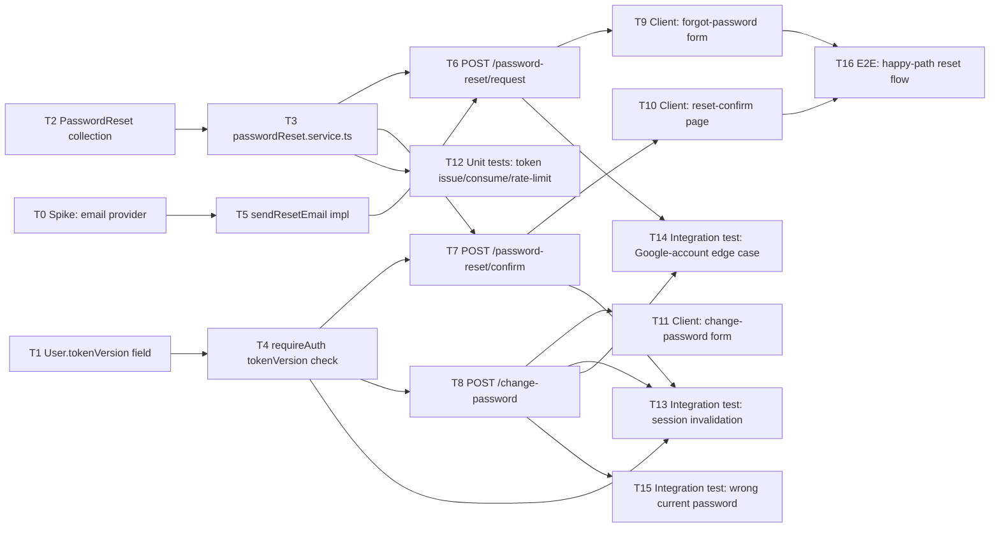

# Task divide — forgot-password

<!-- Stage 08 → see skills/divide-tasks/SKILL.md -->

## Upstream artefacts

- PRD: [../PRD.md](../PRD.md) — AC-01..AC-06, NFR (§6), security/privacy (§6.1)
- SAD: [../sad.md](../sad.md) — §4 solution strategy, §5 building blocks, §6 runtime (US-01..US-05 sequences), §9 ADR index, §10 quality requirements, §11 risks
- ADR-0001 (Accepted): [../adr/0001-store-reset-tokens-in-a-separate-collection.md](../adr/0001-store-reset-tokens-in-a-separate-collection.md)
- ADR-0002 (Accepted): [../adr/0002-tokenversion-counter-for-session-invalidation.md](../adr/0002-tokenversion-counter-for-session-invalidation.md)
- Data model: [../data-model.md](../data-model.md) — `User.tokenVersion`, new `PasswordReset` collection
- API contract: [../contracts/openapi.yaml](../contracts/openapi.yaml) — 3 endpoints

## Open-decision handling (was blocking this stage)

SAD §11 / PRD §8 flag the email-delivery provider as an **open architectural decision**, "resolve before implementation starts" — still unresolved at this stage. Resolved for task-divide purposes as:

- **T0 is a timeboxed spike**, not a full implementation task: decide and document the provider (or confirm a dev-only stub is enough for v1, given "nice to have," no hard deadline — PRD §1).
- Every other task is written against `passwordReset.service.ts`'s pluggable send-email boundary (SAD §4 strategic choice 3), so T1–T4 and T6–T16 do **not** depend on T0 and can proceed in parallel with it. Only **T5** (the concrete `sendResetEmail` implementation) depends on T0's outcome.
- If the spike's outcome changes the interface shape (unlikely — SAD already fixes "one function signature"), that surfaces as a review comment on T5, not a re-plan of this epic.

## Dependency graph

## Tasks

| ID | Title | DoR | DoD | Deps | Estimate | Owner |
|----|-------|-----|-----|------|----------|-------|
| T0 | [Spike: decide email-delivery provider](./spike-email-provider.md) | PRD §8 open question | decision documented, unblocks T5 | — | S | Tanya19Lion |
| T1 | [Add User.tokenVersion field](./user-tokenversion-field.md) | ADR-0002 Accepted | PR merged, schema-change log entry present | — | XS | Tanya19Lion |
| T2 | [Create PasswordReset collection](./passwordreset-collection.md) | ADR-0001 Accepted | PR merged, indexes present, schema-change log entry present | — | S | Tanya19Lion |
| T3 | [passwordReset.service.ts: issue/verify/consume/rate-limit](./password-reset-service.md) | T2 done | PR merged, unit tests (T12) pass | T2 | S | Tanya19Lion |
| T4 | [requireAuth: tokenVersion check](./require-auth-tokenversion.md) | T1 done | PR merged, existing auth tests still green | T1 | S | Tanya19Lion |
| T5 | [sendResetEmail implementation](./send-reset-email-impl.md) | T0 done | PR merged, email observably sent/logged per T0 decision | T0 | S | Tanya19Lion |
| T6 | [POST /api/auth/password-reset/request](./route-request-reset.md) | T3, T5 done | PR merged, matches openapi.yaml (200/429/4XX) | T3, T5 | S | Tanya19Lion |
| T7 | [POST /api/auth/password-reset/confirm](./route-confirm-reset.md) | T3, T4 done | PR merged, matches openapi.yaml (200/400/4XX) | T3, T4 | S | Tanya19Lion |
| T8 | [POST /api/auth/change-password](./route-change-password.md) | T4 done | PR merged, matches openapi.yaml (200/400/409/4XX) | T4 | S | Tanya19Lion |
| T9 | [Client: forgot-password request form](./client-forgot-password-form.md) | T6 done | PR merged, wires LoginPage's dead "Forgot password" link | T6 | S | Tanya19Lion |
| T10 | [Client: reset-confirm page](./client-reset-confirm-page.md) | T7 done | PR merged, handles invalid/expired token messaging (AC-03) | T7 | S | Tanya19Lion |
| T11 | [Client: change-password form (profile)](./client-change-password-form.md) | T8 done | PR merged, handles AC-04/AC-05/AC-06 responses | T8 | S | Tanya19Lion |
| T12 | [Unit tests: token issue/consume/rate-limit (QG-1)](./unit-tests-token-service.md) | T3 done | tests green, covers single-use + ≤15min TTL + rate-limit | T3 | S | Tanya19Lion |
| T13 | [Integration test: session invalidation (QG-2, AC-06)](./integration-test-session-invalidation.md) | T4, T7, T8 done | ≥2 sessions issued, all-but-one rejected after change | T4, T7, T8 | S | Tanya19Lion |
| T14 | [Integration test: Google-account edge case (QG-3, AC-05)](./integration-test-google-account.md) | T6, T8 done | both entry points assert explicit hint, no dead end | T6, T8 | S | Tanya19Lion |
| T15 | [Integration test: wrong current password (QG-4, AC-04)](./integration-test-wrong-password.md) | T8 done | asserts rejection + passwordHash unchanged | T8 | XS | Tanya19Lion |
| T16 | [E2E: happy-path reset flow (AC-01)](./e2e-happy-path.md) | T9, T10 done | e2e green: request → email link → confirm → login with new password | T9, T10 | S | Tanya19Lion |

## Estimation legend

- XS: ≤2h
- S: ≤1d
- M: 1-2d (borderline — consider splitting)
- L: must be split, ≤1d did not work out

## Notes

- Effort budget (idea-brief §11): ~4 person-weeks. Sum of estimates above (~13-14d at S≈1d) lands
  comfortably inside that budget with room for the T0 spike's uncertainty.
- Rate-limiting for **unregistered** emails needs a separate mechanism from the `PasswordReset`-count approach (data-model.md's own flagged gap — AC-02 means no document exists to count for an unknown email). T3's DoD must not silently skip this case; flagged explicitly in T3's story.
- No task added for root `docs/data-model.md` — this feature's schema-change entries already live in the feature-level `../data-model.md`'s own Schema-change log (T1/T2 DoD references it), matching this project's no-migration-tool profile (`.claude/rules/migrations.md`).
