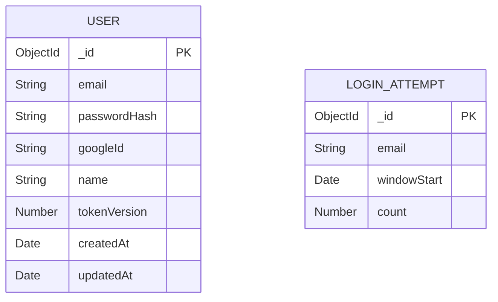

# Data model — remember-me

> Persistence profile: **no-migration-tool** (MongoDB via Mongoose, no migration tool adopted —
> `.claude/rules/migrations.md`, root `docs/adr/0001-initial-setup.md`). Types below are Mongoose
> schema types; there is no separate `id-type`/`bounded-string-type` translation layer.

## ER diagram

`LoginAttempt` has no reference to `User` — it is keyed by the raw login-attempt `email`, checked
*before* any credential lookup succeeds (SAD §6 Critical flow 1 runs the rate-limit check ahead of
`UserModel.findOne`), so a `ref: 'User'` relationship would not resolve for unknown/mistyped
emails, which is exactly the case this collection exists to rate-limit.

## Entities

### `User` (extended, not new)

| Field | Type | Constraints | Notes |
|---|---|---|---|
| `_id` | `ObjectId` | PK | Mongo native id — existing project convention (`.claude/rules/migrations.md`), unchanged by this feature. |
| `tokenVersion` | `Number` | optional (Phase 1 — see Schema-change log) | ADR-0001: bumped on logout or password reset; embedded in access/refresh tokens at issuance, compared in `requireAuth`. No schema `default` yet — see Phase 2/3 below before this can safely become `required: true`. |
| `createdAt` / `updatedAt` | `Date` | `{ timestamps: true }`, unchanged | Pre-existing shipped exception to this project's createdAt-only default (`.claude/rules/migrations.md` Defaults) — not touched by this feature. |

All other `User` fields (`googleId`, `passwordHash`, `email`, `name`, `avatarUrl`) are unchanged by
this feature.

<!-- Why: business logic (what a tokenVersion mismatch means, when to bump it) lives in
     auth.controller.ts / middleware/auth.ts, not in the schema — the schema only carries the
     counter's shape. -->

### `LoginAttempt` (new — ADR-0003)

| Field | Type | Constraints | Notes |
|---|---|---|---|
| `_id` | `ObjectId` | PK | Mongo native id, same convention as `User`. |
| `email` | `String` | required, unique | One active document per email — the login handler upserts by `email`, incrementing `count` on each attempt. Not a `ref` to `User._id`: the check runs before credential lookup, so it must work for emails that don't resolve to a `User` at all. |
| `windowStart` | `Date` | required, default = `Date.now` | Genuine identity/genesis default (record-creation time), not a business decision — matches `.claude/rules/migrations.md`'s allowed-default carve-out. Anchors the TTL window; app code does not reset it on subsequent attempts within the same window (fixed window, not sliding, per ADR-0003). |
| `count` | `Number` | required, no schema default | Set to `1` on first attempt and incremented on each retry by app code (`auth.controller.ts` login handler) — deliberately no schema-level default so the "starts at 1" business rule stays in code, not the store. |

No `createdAt`/`updatedAt` on this entity: `windowStart` already anchors both "when this window
began" and the TTL expiry — a second identity timestamp would be redundant (deviates from this
project's `{ timestamps: true }` shipped-exception default because there is nothing for a second
timestamp to add here, not because the default was skipped by oversight).

<!-- Why: the ≤5-attempts/15-min rate-limit rule itself (when to block, when to reset the window)
     lives in the login controller/middleware, not as a schema validate()/pre('save') hook. -->

## Indexes

| Index | Fields | Query it serves |
|---|---|---|
| `LoginAttempt` unique on `email` | `{ email: 1 }` (via `unique: true`) | Upsert-by-email on every login attempt (SAD §4 ADR-0003: "read + upsert on `LoginAttempt`"). |
| `LoginAttempt` TTL on `windowStart` | `{ windowStart: 1 }`, `expireAfterSeconds: 900` | Auto-expires a `LoginAttempt` document 15 minutes after window start, implementing the PRD §6 "≤5 attempts / 15 min" fixed window with no manual cleanup job (ADR-0003 Neutral consequence). |

No new index on `User` — `email` already carries a `unique` index from the existing schema; SAD's
`requireAuth` `tokenVersion` comparison is a document-level field check on an already-fetched
`User`, not a separate query, so it needs no index of its own.

## Schema-change log

### 2026-09-10 — add `User.tokenVersion` (Phase 1 of 3, ADR-0001)

- **Change:** added `tokenVersion: { type: Number }` to `src/models/User.ts` — optional, no
  `default`, no `required`. Purely additive; no existing code path reads or writes it yet.
- **Backfill:** none yet. **Phase 2 (not yet scheduled)** will backfill `tokenVersion: 0` onto every
  existing `User` document with a one-off script (`UserModel.updateMany({ tokenVersion: { $exists:
  false } }, { $set: { tokenVersion: 0 } })`) before `requireAuth`'s revocation check goes live —
  owner: whoever implements the ADR-0001 `requireAuth` check (tracked at stage 08 task breakdown).
- **Rollback:** `UserModel.updateMany({}, { $unset: { tokenVersion: '' } })`, then remove the field
  from `User.ts`. Safe at Phase 1 because nothing depends on the field yet.

### 2026-09-10 — create `LoginAttempt` collection (ADR-0003)

- **Change:** new `src/models/LoginAttempt.ts` — `email` (unique), `windowStart` (TTL-indexed,
  `expireAfterSeconds: 900`), `count`. No existing collection affected.
- **Backfill:** none needed — greenfield collection, populated only by new login attempts going
  forward.
- **Rollback:** drop the `loginattempts` collection (`db.loginattempts.drop()`) and delete
  `src/models/LoginAttempt.ts`; no other collection references it, so nothing else needs cleanup.

## Test fixtures

No backend test-fixture/factory convention exists in this repo yet (only
`src/services/ai.service.test.ts` exists today, with no shared fixtures file). Not introducing one
here — out of scope for a data-model pass with no test suite yet exercising `User`/`LoginAttempt`.
Whoever implements the stage-08 tasks touching `auth.controller.ts` should either inline
`UserModel.create({ email: 'user@example.test', ... })` calls per this repo's current style, or
raise a separate decision if a shared fixtures file becomes worth introducing.
