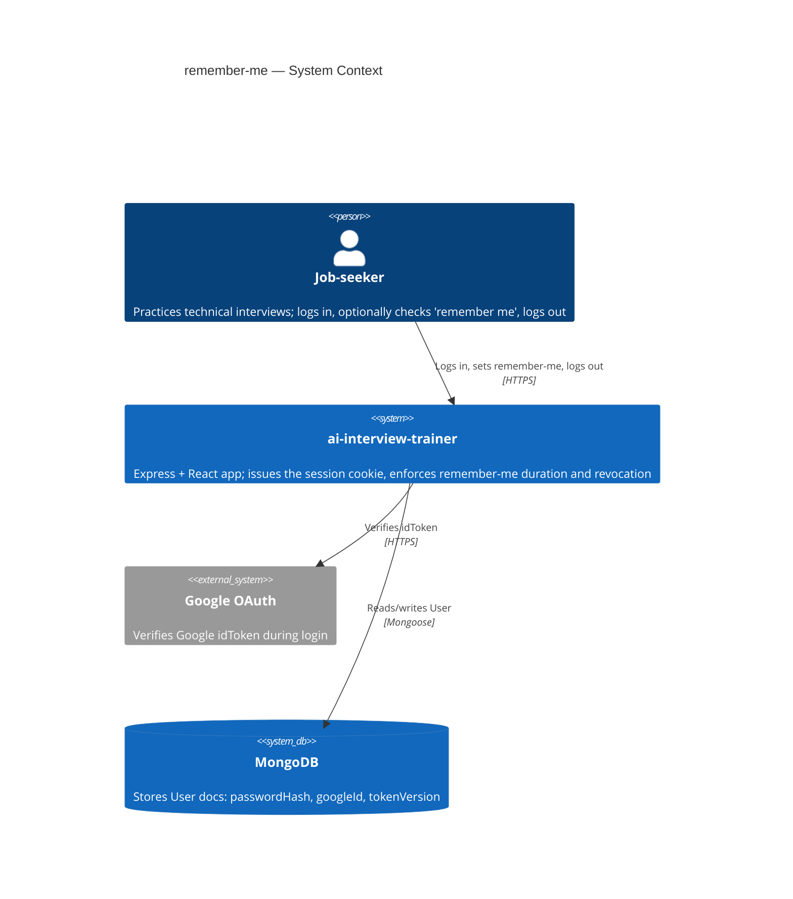
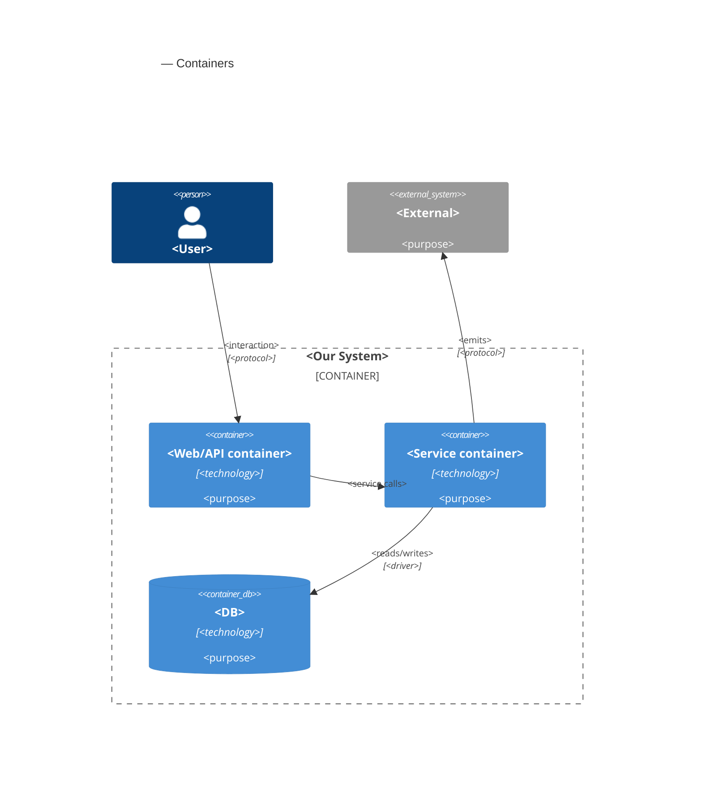
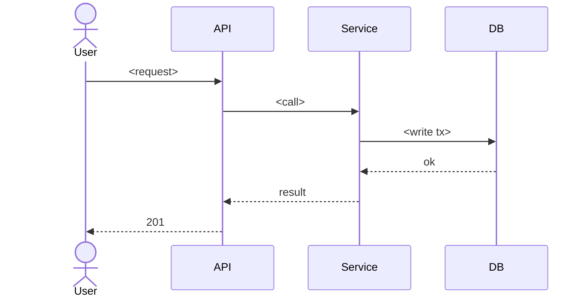

# Software Architecture Document — remember-me

<!-- Generated by the architecture-design skill — see its SKILL.md for the 8-step protocol. -->
<!-- 12 Arc42 sections. Empty sections — <!-- N/A: <one-line reason> -->. -->
<!-- C4 Context (L1) lives inline in §3. C4 Container (L2) lives inline in §5. -->

## 1. Introduction and goals

<!-- 🎯 Навіщо: стабільна памʼять про «що + три головні якості + хто зацікавлений».     -->
<!--           Через рік ніхто не згадає на словах, ЯКІ ТРИ ЯКОСТІ для системи критичні. -->
<!-- 📋 Що писати: 1 абзац intent + 3 рядки топ-3 якості + таблиця stakeholders.        -->
<!-- 📌 Приклад: «QG-1: швидкість редагування блоку p95 ≤500 мс»                         -->

**Intent.** Job-seekers explicitly choose whether their login session persists across browser
closes ("remember me"), closing today's silent always-persistent default (PRD §2). The
remembered-session duration is communicated only when it matters — at expiry, not shown as a
forward-looking date. Session-security posture stays intact when a job-seeker resets their
password or logs out — no long-lived remembered session outlives either event (PRD §2, AC-04,
AC-07).

**Top-3 quality goals (1-liners; full scenarios in §10):**

1. QG-1 — Session-revocation security: a remembered-session token must stop working immediately
   after a password reset or a logout, even if replayed (PRD AC-04, AC-07; idea-brief §10 top
   risk).
2. QG-2 — Login/session-check latency: login p95 ≤ 300 ms, session-check (`/me`) p95 ≤ 150 ms
   (PRD §6).
3. QG-3 — Cross-instance expiry consistency: remembered-session expiry check stays consistent
   across server instances within ±1 minute clock-skew tolerance (PRD §6).

**Stakeholders.**

| Role | Interest | Sign-off owner? |
|---|---|---|
| Job-seeker (CONTEXT glossary — single end-user role) | Uses "remember me" at login; trusts logout/password-reset to end old sessions | No |
| Tech Lead | SAD approval; owns implementing the `tokenVersion` invalidation mechanism (shared with `forgot-password`) and the login rate limit | Yes |

## 2. Constraints

<!-- 🎯 Навіщо: §4 (стратегія) працює тільки коли §2 зафіксувала, ЩО ВЖЕ ЗАФІКСОВАНО:    -->
<!--           стек, версії, дедлайн, регуляторні вимоги. Це вхід, не вихід.             -->
<!-- 📋 Що писати: чотири блоки — Технічні / Організаційні / Конвенції / Регуляторні.     -->
<!-- 📌 Приклад: «Postgres 18» (не «Postgres»); «дедлайн Q3 — жорсткий» (не «бажано»).    -->

**Technical.**
- TypeScript, ESM (`"type": "module"`) on both backend and frontend.
- Backend: Node + Express 4.21, `mongoose` 8.9, `jsonwebtoken` 9.0, `bcryptjs` 3.0,
  `cookie-parser` 1.4, `google-auth-library` 9.15. Run via `tsx watch src/index.ts` (dev) / `tsc`
  (build).
- Frontend: Vite 8 + React 19.2, `react-router-dom` 7.18, `@tanstack/react-query` 5.101,
  `@react-oauth/google` 0.13.5.
- Datastore: MongoDB via Mongoose only — no session/refresh-token collection exists today;
  sessions are stateless JWTs in an httpOnly cookie.
- No rate-limiting package (`express-rate-limit` or equivalent) exists in `package.json` today —
  remember-me's rate-limit NFR (PRD §6) introduces a new dependency.

**Organisational.**
- Effort budget: ~2 person-weeks (idea-brief §11 RICE Effort), feature_size S.
- No hard deadline — proactive UX/security work (idea-brief §4), not incident- or contract-driven.
- Team composition: not specified in PRD; assume 1 backend-leaning engineer given the S size and
  single reference module.

**Conventions.**
- `.claude/rules/backend/auth.md` — three login paths (`googleLogin`, `register`, `login`) all
  funnel through the single `issueSession(res, user)` choke point in `auth.controller.ts`, which
  signs the JWT and sets the httpOnly `token` cookie. Any remember-me variant must extend this one
  function, not add a second cookie-issuing path.
- Layering: routes → controllers → models directly for auth today (no separate services layer in
  `src/controllers/auth.controller.ts` — controllers call `UserModel` directly). This differs from
  the project's general `routes → controllers → services → models` convention documented in root
  `docs/sad.md` — auth is a pre-existing exception, not something this feature should "fix"
  unprompted.
- `requireAuth` (`src/middleware/auth.ts`) is the single verification chokepoint for all protected
  routes — currently signature/expiry check only, no DB lookup (no revocation check exists yet).

**Regulatory / external.**
- PRD §6.1: data classification confidential (the session token governs access to a job-seeker's
  stored interview history/answers); security review required before release.
- No GDPR/SOC2/PCI-specific requirement identified in PRD or CONTEXT for this feature.

## 3. Context and scope

<!-- 🎯 Навіщо: малює КОРДОН СИСТЕМИ — хто з нею говорить ззовні, де закінчується зона довіри. -->
<!--           Без §3 §5 і §8 (авторизація) розпливаються — неясно, що «всередині», а що «зовні». -->
<!-- 📋 Що писати: 2-3 речення бізнес-контексту + таблиця зовнішніх систем + Mermaid C4Context. -->
<!-- 📌 Приклад: «зовнішні — нема (свідома відмова від third-party у v1)» — це теж рішення.   -->
<!-- Кордон довіри (trust boundary) — лінія, за якою ти не довіряєш даним без перевірки.       -->

Job-seekers (the product's single user role) log in to `ai-interview-trainer` to practice
technical interviews. remember-me lets a job-seeker opt into a persistent login (checkbox at sign
in) instead of today's silent always-7-day default; the system authenticates via email/password or
Google OAuth, and stores the resulting session as a JWT in an httpOnly cookie.

**External systems (in / out):**

| Actor or system | Type | Interaction |
|---|---|---|
| Job-seeker | Person | Logs in (email/password or Google), checks "remember me", logs out |
| Google OAuth | System (external) | Verifies the Google `idToken` presented during the `googleLogin` path |
| MongoDB | System (data store) | Stores `User` documents (`passwordHash`, `googleId`, and the incoming `tokenVersion` field this feature depends on) |

**C4 Context (L1):**



## 4. Solution strategy

<!-- 🎯 Навіщо: 3-4 СТРАТЕГІЧНІ СТОВПИ, з яких потім ростуть усі ADR. Без §4 кожен ADR    -->
<!--           виглядає випадковим — нема зонтика. ⭐ Найгустіша секція — тут ADR-gate    -->
<!--           спрацьовує майже завжди (рішення незворотні + мульти-модульні).            -->
<!-- 📋 Що писати: список з 3-4 виборів. На кожен — заголовок + 2-3 речення rationale.    -->
<!-- 📌 Приклад: «Зберігати урок як таблицю блоків» — стовп, з якого виросло ADR-0001.    -->

**Top-3 strategic choices (the seeds for ADRs):**

1. **<e.g. Module isolation through events>** — <2-3 sentences rationale referencing Quality Goals and constraints>.
2. **<e.g. Single-store persistence (Postgres)>** — <2-3 sentences>.
3. **<e.g. Server-rendered dashboard>** — <2-3 sentences>.

Each tactical decision in later sections should be traceable to one of these strategic seeds. Tactical decisions that *contradict* a strategic choice are red flags — surface them in §11 Risks.

## 5. Building block view

<!-- 🎯 Навіщо: ВНУТРІШНЯ ДЕКОМПОЗИЦІЯ — модулі, контейнери, БД. Статична топологія:   -->
<!--           хто з ким може говорити. Без §5 §6 (сценарії) не має словника учасників. -->
<!-- 📋 Що писати: 1 абзац про стиль (шари/гексагональна/clean/на подіях) +            -->
<!--           дерево папок + Mermaid C4Container.                                       -->
<!-- 📌 Приклад: «web-app, content-api, media-worker, postgres, s3, cdn».                -->

<One paragraph: layered / hexagonal / clean / event-driven. Why.>

**Internal decomposition:**

```
<e.g. internal/modules/goals/>
├── domain/       <entities + sentinel errors>
├── app/          <use cases / services>
├── infra/        <repository + outbox impl>
├── ports/        <HTTP handlers, DTOs, error mapping>
└── module.go     <self-wiring>
```

**C4 Container (L2):**



## 6. Runtime view

<!-- 🎯 Навіщо: ПОТІК У RUNTIME для 1-2 критичних сценаріїв. Хто з ким коли і у якому     -->
<!--           порядку говорить. Без §6 §5 — лише купа коробок без життя.                  -->
<!-- 📋 Що писати: Mermaid sequenceDiagram. Учасники — імена з §5 (не вигадуй нові!).      -->
<!--           Повідомлення семантичні («складає чорновик»), БЕЗ HTTP-методів/шляхів —     -->
<!--           ендпоінт-рівневі sequence-діаграми — це вже наступний крок (API design), не цей skill. -->
<!-- 📌 Приклад: «methodist → web-app: складає чорновик → web-app → content-api: зберегти». -->

**Critical flow 1: <flow name>**



<!-- For XS/S: 1 flow above is enough. For M+: add 2-4 more (e.g. failure-mode flow, async flow). -->

**Critical flow 2: <e.g. async event propagation>** — <if applicable, otherwise N/A>.

## 7. Deployment view

<!-- 🎯 Навіщо: ТОПОЛОГІЯ, яку DevOps має знати без читання Helm-чартів — скільки реплік,  -->
<!--           де живе фоновий обробник, ПРИ ЯКИХ ЧИСЛАХ масштабуємось.                     -->
<!-- 📋 Що писати: 2-3 речення про топологію + метрики + алерти + конкретні числа-пороги.   -->
<!-- 📌 Приклад: «500 IC → партиціонування за кварталом» (не «при зростанні подумаємо»).    -->
<!-- 🎯 Можна N/A для XS/S функцій, що переюзають існуюче розгортання без змін.            -->

<Topology in 2-3 sentences. Where it runs (k8s / VM / serverless), replicas, scaling thresholds.>

**Monitoring:**
- <Metrics — e.g. Prometheus `<metric_name>`>
- <Alerts — e.g. "outbox lag > 10 min → page on-call">
- <Tracing — e.g. OpenTelemetry HTTP spans>

**Scaling thresholds:**
- <e.g. 500 IC × 5 goals × 26 checkpoints/Q = 65k rows/year — comfortable in one table>
- <e.g. partitioning by quarter at >500k rows/year>

<!-- For XS/S that doesn't change deployment: <!-- N/A: feature reuses existing deployment unit -->. -->

## 8. Crosscutting concepts

<!-- 🎯 Навіщо: НАСКРІЗНІ ПАТЕРНИ, які перетинають кілька модулів: логування, помилки,    -->
<!--           авторизація, ID strategy, outbox, кеш. ⭐ Друга найгустіша секція.          -->
<!--           Якщо патерн всередині одного модуля — він НЕ сюди. Якщо це конвенція        -->
<!--           проєкту в цілому — у CLAUDE.md.                                              -->
<!-- 📋 Що писати: таблиця концепт / конвенція / де визначено. Один рядок на концепт.      -->
<!-- 📌 Приклад: «UUID v7 (час+випадковий, сортується) у app-layer» — як default з CLAUDE.md. -->

| Concept | Convention | Where defined |
|---|---|---|
| Logging | <e.g. structured slog, fields `module=<name>`> | <CLAUDE.md §X or here> |
| Authentication | <e.g. JWT via session middleware> | <CLAUDE.md §X> |
| Error handling | <e.g. domain sentinel → ports/errors.go → apperr JSON> | <CLAUDE.md §X> |
| ID strategy | <e.g. UUID v7 in app layer> | <CLAUDE.md §X> |
| Internationalisation | <e.g. N/A, English only> | — |
| Observability | <e.g. OpenTelemetry on HTTP boundaries> | — |
| Outbox / events | <module-specific patterns, if any> | <here> |

## 9. Architecture decisions

<!-- 🎯 Навіщо: ЗВОРОТНИЙ ІНДЕКС на папку adr/. `ls adr/` дає файли, §9 дає семантику —    -->
<!--           чому вони існують, до якого зрізу SAD привʼязані, у якому статусі.           -->
<!-- 📋 Що писати: таблиця з 4 колонками. Один рядок на ADR. Mixed status — це OK.         -->
<!-- 📌 Приклад: «0001 | Зберігати урок як таблицю блоків | Accepted | §4».                -->

| # | Title | Status | Section |
|---|---|---|---|
| <NNNN> | <imperative — e.g. "Use sliding window for rate limiting"> | Accepted | §<N> |
| <NNNN> | <imperative — e.g. "Co-locate outbox worker in API process"> | Accepted | §<N> |

ADR files live under `docs/features/<slug>/adr/NNNN-<title>.md`.

## 10. Quality requirements

<!-- 🎯 Навіщо: ДЕРЕВО ЯКОСТЕЙ (Quality Tree) — беремо мету з §1 і розкладаємо на          -->
<!--           конкретні листя: тести, метрики, конфіги, drill-и. ⭐ Без §10 §1 — це       -->
<!--           маніфест. З §10 кожна декларація мапиться на щось, ЩО МОЖНА ДОВЕСТИ.        -->
<!-- 📋 Що писати: на кожну якість з §1 — When / Then / How verify. Числа з PRD §6 NFR     -->
<!--           ДОСЛІВНО (не округлюй p95 ≤250мс до ≤300мс — це F6-помилка критика).        -->
<!-- 📌 Приклад: «p95 ≤500 мс на UPDATE блоку, перевіримо k6 load test 100 req/s».        -->

Each top-3 goal from §1 expanded into a full scenario:

**QG-1. <quality attribute>**
- **When:** <trigger condition>
- **Then:** <expected behavior with numbers from PRD NFR>
- **How verify:** <test / chaos drill / load test / observability>

**QG-2. <quality attribute>**
- **When:** <trigger>
- **Then:** <expected>
- **How verify:** <how>

**QG-3. <quality attribute>**
- **When:** <trigger>
- **Then:** <expected>
- **How verify:** <how>

## 11. Risks and technical debt

<!-- 🎯 Навіщо: ⭐ збирає ВСЕ, що може зламатись — і не лише технічне. Без §11 ризики   -->
<!--           обговорюються на стендапах і губляться; борг лишається у голові того,    -->
<!--           хто його прийняв.                                                          -->
<!-- 📋 Що писати: таблиця ризик/борг — серйозність — мітигація — власник. Технічний    -->
<!--           борг окремою секцією.                                                      -->
<!-- 📌 Приклад: «EM не пушить — member не оновлює дані | High | …». Перший ризик —      -->
<!--           часто продуктовий, не технічний. Це нормально.                            -->

<!-- Severity column literals: Low / Medium / High for regular risks; "Open question" for rows
     created by Step-7 `Save as Open Question` resolutions (see references/socratic-loop.md). -->

| Risk / debt | Severity | Mitigation | Owner |
|---|---|---|---|
| <e.g. Outbox lag may reach hours during downstream outage> | Medium | <Alert >10 min, on-call playbook, retry backoff> | <DevOps> |
| <e.g. No event schema versioning in v1> | Medium | <ADR-NNNN planned for v2, graceful handling of unknown fields> | <Backend> |
| Open architectural decision: <decision-headline> | Open question | Resolve before <stage trigger or YYYY-MM-DD>; <inline rationale from Step-7 Save-as-OQ> | <owner> |

**Accepted debt (acceptable in v1, plan to fix later):**
- <e.g. Goal entity is not versioned (immutable) — OK for v1, may need audit versioning in v2>

## 12. Glossary

<!-- 🎯 Навіщо: ⭐ СЛОВНИК ДОМЕНУ, який припиняє суперечки через рік («checkpoint —      -->
<!--           weekly чи biweekly? Quarter — календарний чи фіскальний?»).                -->
<!-- 📋 Що писати: таблиця термін / значення. Бізнес-терміни + технічні вперемішку.       -->
<!--           Один термін може мати дві мови у заголовку: «Goal (Обʼєктив)».              -->
<!-- 📌 Приклад: «Lesson | урок усередині курсу, що складається з блоків (text, video)». -->

| Term | Meaning |
|---|---|
| <e.g. Goal> | <quarterly intent in statement form> |
| <e.g. KR> | <Key Result — measurable target linked to a Goal> |
| <e.g. Checkpoint> | <bi-weekly progress update on a KR> |