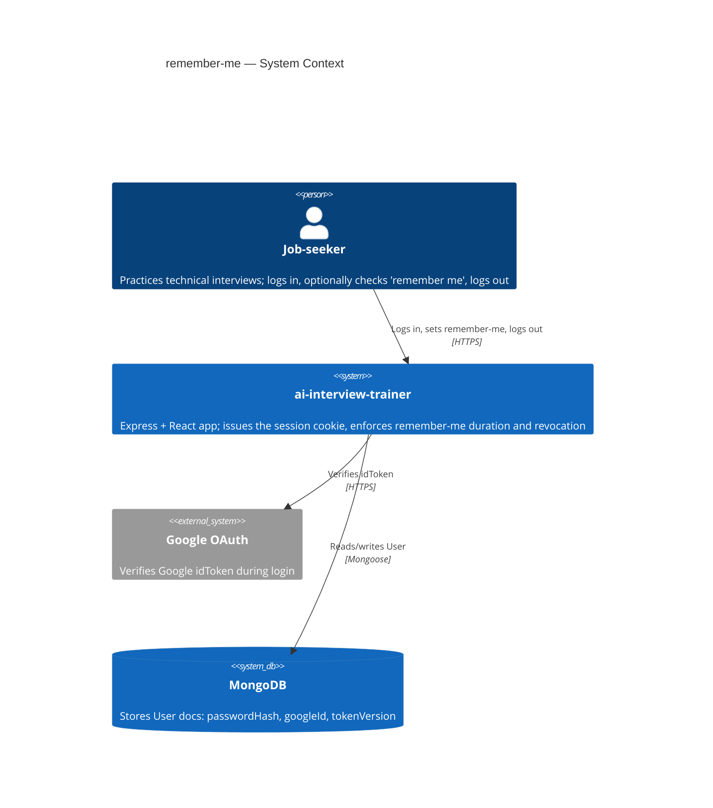
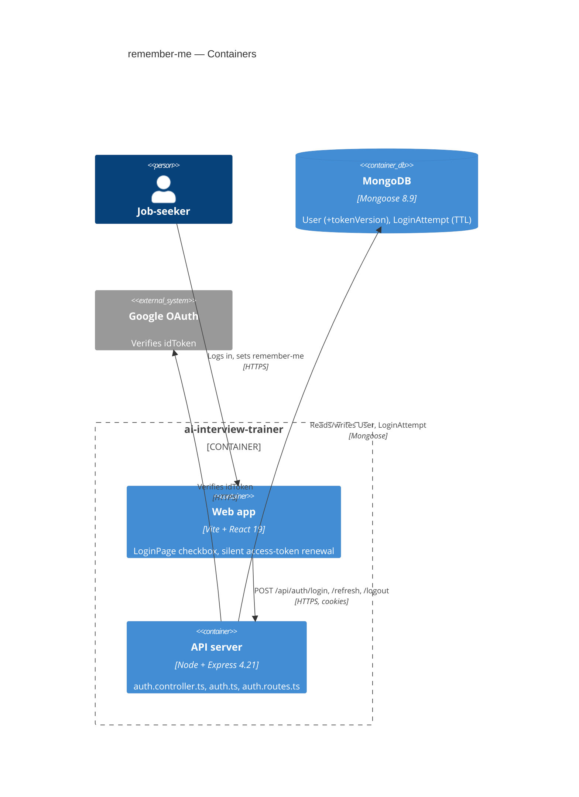
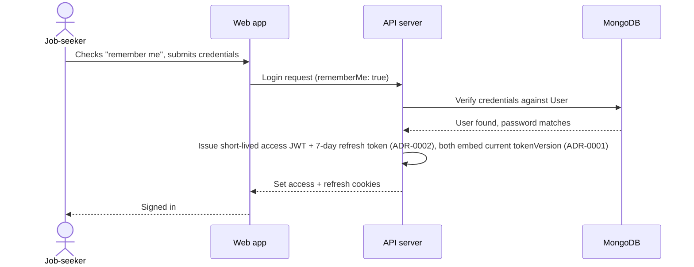
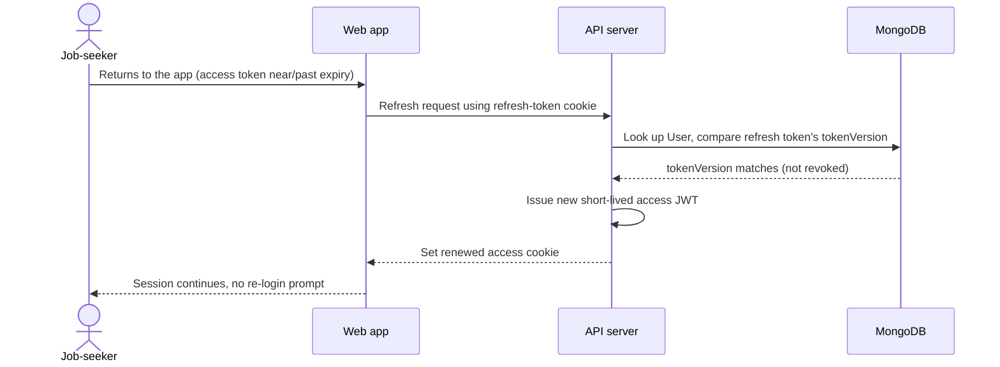
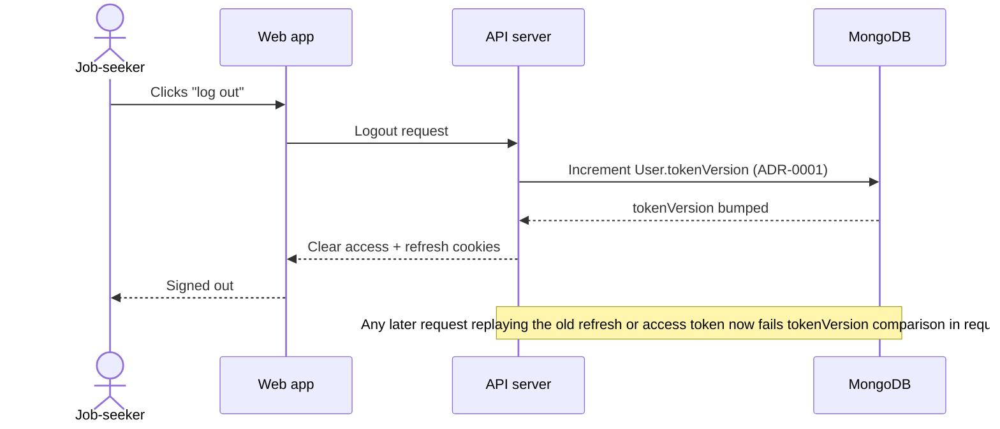
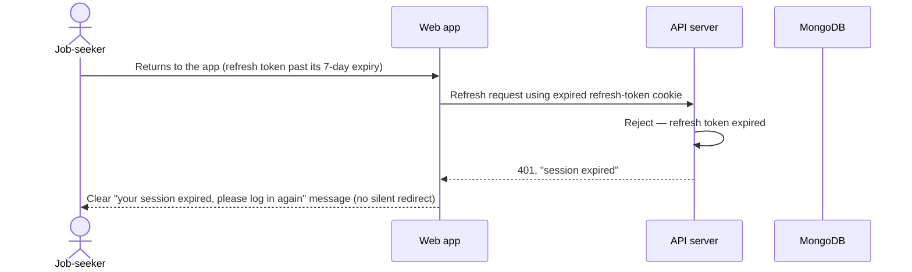

# Software Architecture Document — remember-me

<!-- Generated by the architecture-design skill — see its SKILL.md for the 8-step protocol. -->
<!-- 12 Arc42 sections. Empty sections — <!-- N/A: <one-line reason> -->. -->
<!-- C4 Context (L1) lives inline in §3. C4 Container (L2) lives inline in §5. -->

## 1. Introduction and goals

<!-- 🎯 Навіщо: стабільна памʼять про «що + три головні якості + хто зацікавлений».     -->
<!--           Через рік ніхто не згадає на словах, ЯКІ ТРИ ЯКОСТІ для системи критичні. -->
<!-- 📋 Що писати: 1 абзац intent + 3 рядки топ-3 якості + таблиця stakeholders.        -->
<!-- 📌 Приклад: «QG-1: швидкість редагування блоку p95 ≤500 мс»                         -->

**Intent.** Job-seekers explicitly choose whether their login session persists across browser
closes ("remember me"), closing today's silent always-persistent default (PRD §2). The
remembered-session duration is communicated only when it matters — at expiry, not shown as a
forward-looking date. Session-security posture stays intact when a job-seeker resets their
password or logs out — no long-lived remembered session outlives either event (PRD §2, AC-04,
AC-07).

**Top-3 quality goals (1-liners; full scenarios in §10):**

1. QG-1 — Session-revocation security: a remembered-session token must stop working immediately
   after a password reset or a logout, even if replayed (PRD AC-04, AC-07; idea-brief §10 top
   risk).
2. QG-2 — Login/session-check latency: login p95 ≤ 300 ms, session-check (`/me`) p95 ≤ 150 ms
   (PRD §6).
3. QG-3 — Cross-instance expiry consistency: remembered-session expiry check stays consistent
   across server instances within ±1 minute clock-skew tolerance (PRD §6).

**Stakeholders.**

| Role | Interest | Sign-off owner? |
|---|---|---|
| Job-seeker (CONTEXT glossary — single end-user role) | Uses "remember me" at login; trusts logout/password-reset to end old sessions | No |
| Tech Lead | SAD approval; owns implementing the `tokenVersion` invalidation mechanism (shared with `forgot-password`) and the login rate limit | Yes |

## 2. Constraints

<!-- 🎯 Навіщо: §4 (стратегія) працює тільки коли §2 зафіксувала, ЩО ВЖЕ ЗАФІКСОВАНО:    -->
<!--           стек, версії, дедлайн, регуляторні вимоги. Це вхід, не вихід.             -->
<!-- 📋 Що писати: чотири блоки — Технічні / Організаційні / Конвенції / Регуляторні.     -->
<!-- 📌 Приклад: «Postgres 18» (не «Postgres»); «дедлайн Q3 — жорсткий» (не «бажано»).    -->

**Technical.**
- TypeScript, ESM (`"type": "module"`) on both backend and frontend.
- Backend: Node + Express 4.21, `mongoose` 8.9, `jsonwebtoken` 9.0, `bcryptjs` 3.0,
  `cookie-parser` 1.4, `google-auth-library` 9.15. Run via `tsx watch src/index.ts` (dev) / `tsc`
  (build).
- Frontend: Vite 8 + React 19.2, `react-router-dom` 7.18, `@tanstack/react-query` 5.101,
  `@react-oauth/google` 0.13.5.
- Datastore: MongoDB via Mongoose only — no session/refresh-token collection exists today;
  sessions are stateless JWTs in an httpOnly cookie.
- No rate-limiting package (`express-rate-limit` or equivalent) exists in `package.json` today —
  remember-me's rate-limit NFR (PRD §6) introduces a new dependency.

**Organisational.**
- Effort budget: ~2 person-weeks (idea-brief §11 RICE Effort), feature_size S.
- No hard deadline — proactive UX/security work (idea-brief §4), not incident- or contract-driven.
- Team composition: not specified in PRD; assume 1 backend-leaning engineer given the S size and
  single reference module.

**Conventions.**
- `.claude/rules/backend/auth.md` — three login paths (`googleLogin`, `register`, `login`) all
  funnel through the single `issueSession(res, user)` choke point in `auth.controller.ts`, which
  signs the JWT and sets the httpOnly `token` cookie. Any remember-me variant must extend this one
  function, not add a second cookie-issuing path.
- Layering: routes → controllers → models directly for auth today (no separate services layer in
  `src/controllers/auth.controller.ts` — controllers call `UserModel` directly). This differs from
  the project's general `routes → controllers → services → models` convention documented in root
  `docs/sad.md` — auth is a pre-existing exception, not something this feature should "fix"
  unprompted.
- `requireAuth` (`src/middleware/auth.ts`) is the single verification chokepoint for all protected
  routes — currently signature/expiry check only, no DB lookup (no revocation check exists yet).

**Regulatory / external.**
- PRD §6.1: data classification confidential (the session token governs access to a job-seeker's
  stored interview history/answers); security review required before release.
- No GDPR/SOC2/PCI-specific requirement identified in PRD or CONTEXT for this feature.

## 3. Context and scope

<!-- 🎯 Навіщо: малює КОРДОН СИСТЕМИ — хто з нею говорить ззовні, де закінчується зона довіри. -->
<!--           Без §3 §5 і §8 (авторизація) розпливаються — неясно, що «всередині», а що «зовні». -->
<!-- 📋 Що писати: 2-3 речення бізнес-контексту + таблиця зовнішніх систем + Mermaid C4Context. -->
<!-- 📌 Приклад: «зовнішні — нема (свідома відмова від third-party у v1)» — це теж рішення.   -->
<!-- Кордон довіри (trust boundary) — лінія, за якою ти не довіряєш даним без перевірки.       -->

Job-seekers (the product's single user role) log in to `ai-interview-trainer` to practice
technical interviews. remember-me lets a job-seeker opt into a persistent login (checkbox at sign
in) instead of today's silent always-7-day default; the system authenticates via email/password or
Google OAuth, and stores the resulting session as a JWT in an httpOnly cookie.

**External systems (in / out):**

| Actor or system | Type | Interaction |
|---|---|---|
| Job-seeker | Person | Logs in (email/password or Google), checks "remember me", logs out |
| Google OAuth | System (external) | Verifies the Google `idToken` presented during the `googleLogin` path |
| MongoDB | System (data store) | Stores `User` documents (`passwordHash`, `googleId`, and the incoming `tokenVersion` field this feature depends on) |

**C4 Context (L1):**



## 4. Solution strategy

<!-- 🎯 Навіщо: 3-4 СТРАТЕГІЧНІ СТОВПИ, з яких потім ростуть усі ADR. Без §4 кожен ADR    -->
<!--           виглядає випадковим — нема зонтика. ⭐ Найгустіша секція — тут ADR-gate    -->
<!--           спрацьовує майже завжди (рішення незворотні + мульти-модульні).            -->
<!-- 📋 Що писати: список з 3-4 виборів. На кожен — заголовок + 2-3 речення rationale.    -->
<!-- 📌 Приклад: «Зберігати урок як таблицю блоків» — стовп, з якого виросло ADR-0001.    -->

**Top-3 strategic choices (the seeds for ADRs):**

1. **Extend the `User.tokenVersion` counter to also cover logout** (ADR-0001) — reuses the
   session-revocation mechanism `forgot-password` already decided (ADR 0002, Accepted but not yet
   implemented) for password-reset invalidation, adding logout as a second trigger for the same
   counter bump. Satisfies QG-1 and PRD AC-04/AC-07 with one revocation code path in `requireAuth`
   instead of two.
2. **Issue a separate refresh token for remembered sessions** (ADR-0002) — `issueSession()` always
   issues a short-lived access JWT; a checked "remember me" additionally issues a longer-lived
   (7-day, fixed, non-rolling) refresh token. **Deliberate scope override** (PRD §1 ¶4,
   2026-09-10): this supersedes the simpler single-cookie-toggle option idea-brief §14 implicitly
   assumed, raising `feature_size` from S to M in exchange for shrinking the access-token exposure
   window from up to 7 days to minutes — directly strengthening QG-1.
3. **Mongo-backed counter with TTL index for login rate limiting** (ADR-0003) — a new
   `LoginAttempt` collection tracks ≤ 5 attempts / 15 min per email (PRD §6), surviving process
   restarts unlike an in-memory counter, with no new infrastructure beyond the MongoDB the app
   already depends on.

Each tactical decision in later sections should be traceable to one of these strategic seeds. Tactical decisions that *contradict* a strategic choice are red flags — surface them in §11 Risks.

## 5. Building block view

<!-- 🎯 Навіщо: ВНУТРІШНЯ ДЕКОМПОЗИЦІЯ — модулі, контейнери, БД. Статична топологія:   -->
<!--           хто з ким може говорити. Без §5 §6 (сценарії) не має словника учасників. -->
<!-- 📋 Що писати: 1 абзац про стиль (шари/гексагональна/clean/на подіях) +            -->
<!--           дерево папок + Mermaid C4Container.                                       -->
<!-- 📌 Приклад: «web-app, content-api, media-worker, postgres, s3, cdn».                -->

Layered (routes → controllers → models), no hexagonal/clean-architecture split — matches the
project's existing auth code, which already skips the general `services/` layer documented in
root `docs/sad.md` (SAD §2 Constraints). remember-me extends the existing auth files rather than
introducing a new module: `LoginAttempt.ts` is the one genuinely new file, because a new Mongoose
collection cannot live inside an existing model file.

**Internal decomposition:**

```
src/
├── models/
│   ├── User.ts            (+ tokenVersion: number)
│   └── LoginAttempt.ts     NEW — { email, windowStart, count }, TTL index (ADR-0003)
├── controllers/
│   └── auth.controller.ts (issueSession() issues access+refresh (ADR-0002);
│                            + refreshToken handler; logout bumps tokenVersion (ADR-0001))
├── middleware/
│   └── auth.ts             (requireAuth compares JWT tokenVersion vs User.tokenVersion)
└── routes/
    └── auth.routes.ts      (+ POST /refresh route; rate-limit middleware on /login)

client/src/
├── api/auth.ts              (+ refresh call, rememberMe param on login/register)
├── hooks/useAuth.ts          (silent access-token renewal before expiry)
└── pages/LoginPage.tsx       (+ "remember me" checkbox)
```

**C4 Container (L2):**



## 6. Runtime view

<!-- 🎯 Навіщо: ПОТІК У RUNTIME для 1-2 критичних сценаріїв. Хто з ким коли і у якому     -->
<!--           порядку говорить. Без §6 §5 — лише купа коробок без життя.                  -->
<!-- 📋 Що писати: Mermaid sequenceDiagram. Учасники — імена з §5 (не вигадуй нові!).      -->
<!--           Повідомлення семантичні («складає чорновик»), БЕЗ HTTP-методів/шляхів —     -->
<!--           ендпоінт-рівневі sequence-діаграми — це вже наступний крок (API design), не цей skill. -->
<!-- 📌 Приклад: «methodist → web-app: складає чорновик → web-app → content-api: зберегти». -->

**Critical flow 1: Login with "remember me" checked**



**Critical flow 2: Silent access-token renewal**



**Critical flow 3: Logout revokes the remembered session (AC-07)**



**Critical flow 4: Returning with an expired remembered session (AC-03)**



## 7. Deployment view

<!-- N/A: remember-me adds no new deployable unit — all changes (tokenVersion field, LoginAttempt
     collection + TTL index, refresh-token issuance/verification, rate-limit middleware) live
     inside the existing single API container. No new replicas, no worker/cron process, no change
     to scaling thresholds. Reused despite feature_size M — the size bump (ADR-0002 override) is
     application-layer complexity, not deployment-topology complexity. -->

## 8. Crosscutting concepts

<!-- 🎯 Навіщо: НАСКРІЗНІ ПАТЕРНИ, які перетинають кілька модулів: логування, помилки,    -->
<!--           авторизація, ID strategy, outbox, кеш. ⭐ Друга найгустіша секція.          -->
<!--           Якщо патерн всередині одного модуля — він НЕ сюди. Якщо це конвенція        -->
<!--           проєкту в цілому — у CLAUDE.md.                                              -->
<!-- 📋 Що писати: таблиця концепт / конвенція / де визначено. Один рядок на концепт.      -->
<!-- 📌 Приклад: «UUID v7 (час+випадковий, сортується) у app-layer» — як default з CLAUDE.md. -->

| Concept | Convention | Where defined |
|---|---|---|
| Logging | Plain `console.log`/`console.error`, no structured logging library — matches existing `src/index.ts`, `src/config/db.ts` | Existing code (no CLAUDE.md section) |
| Authentication | Two-token JWT (short-lived access + fixed-7-day refresh, ADR-0002), `tokenVersion` revocation check in `requireAuth` (ADR-0001) | `.claude/rules/backend/auth.md` + this SAD §4, ADR-0001, ADR-0002 |
| Error handling | Simple `{ error: string }` JSON on 4xx/5xx responses — matches existing `auth.controller.ts` handlers (e.g. `res.status(401).json({ error: 'Invalid email or password' })`) | Existing code |
| ID strategy | Mongo native `_id` (`ObjectId`) — no app-generated UUIDs, per `.claude/rules/migrations.md` | `.claude/rules/migrations.md` |
| Internationalisation | N/A on the backend (English error strings only, matches existing auth handlers); frontend already has i18next but no remember-me-specific strings decided at this stage | — |
| Observability | None beyond `console.error` — no APM/tracing exists yet (PRD §6 already notes this as a project-wide gap) | — |
| Rate limiting | Mongo-backed `LoginAttempt` counter with TTL index (ADR-0003), ≤ 5 attempts / 15 min per email | ADR-0003 |

## 9. Architecture decisions

<!-- 🎯 Навіщо: ЗВОРОТНИЙ ІНДЕКС на папку adr/. `ls adr/` дає файли, §9 дає семантику —    -->
<!--           чому вони існують, до якого зрізу SAD привʼязані, у якому статусі.           -->
<!-- 📋 Що писати: таблиця з 4 колонками. Один рядок на ADR. Mixed status — це OK.         -->
<!-- 📌 Приклад: «0001 | Зберігати урок як таблицю блоків | Accepted | §4».                -->

| # | Title | Status | Section |
|---|---|---|---|
| 0001 | Extend the User.tokenVersion counter to also cover logout | Accepted | §4 |
| 0002 | Issue a separate refresh token for remembered sessions | Accepted | §4 |
| 0003 | Use a Mongo-backed counter with TTL index for login rate limiting | Accepted | §4 |

ADR files live under `docs/features/<slug>/adr/NNNN-<title>.md`.

## 10. Quality requirements

<!-- 🎯 Навіщо: ДЕРЕВО ЯКОСТЕЙ (Quality Tree) — беремо мету з §1 і розкладаємо на          -->
<!--           конкретні листя: тести, метрики, конфіги, drill-и. ⭐ Без §10 §1 — це       -->
<!--           маніфест. З §10 кожна декларація мапиться на щось, ЩО МОЖНА ДОВЕСТИ.        -->
<!-- 📋 Що писати: на кожну якість з §1 — When / Then / How verify. Числа з PRD §6 NFR     -->
<!--           ДОСЛІВНО (не округлюй p95 ≤250мс до ≤300мс — це F6-помилка критика).        -->
<!-- 📌 Приклад: «p95 ≤500 мс на UPDATE блоку, перевіримо k6 load test 100 req/s».        -->

Each top-3 goal from §1 expanded into a full scenario:

**QG-1. Session-revocation security**
- **When:** a Job-seeker logs out or resets their password (bumping `User.tokenVersion`, ADR-0001).
- **Then:** any access or refresh token issued before the bump is rejected by `requireAuth` on
  its next use, per PRD AC-04 and AC-07 — no grace period.
- **How verify:** integration test — log in, capture the access+refresh tokens, bump
  `tokenVersion` (simulating logout or password reset), replay the captured tokens against a
  protected route, assert 401.

**QG-2. Login/session-check latency**
- **When:** a Job-seeker submits login credentials, or the client calls `/me` to check session
  state.
- **Then:** login p95 ≤ 300 ms; session-check (`/me`) p95 ≤ 150 ms (PRD §6, verbatim).
- **How verify:** k6 smoke test against both endpoints, per PRD §6's "Throughput" measurement row
  (k6 smoke in CI).

**QG-3. Cross-instance expiry consistency**
- **When:** the remembered-session (refresh-token) expiry check runs on any server instance.
- **Then:** the check stays consistent across instances within ±1 minute clock-skew tolerance
  (PRD §6, verbatim) — expiry is evaluated server-side against the token's embedded timestamp, not
  against client-reported time.
- **How verify:** unit test asserting the expiry comparison uses server clock + token timestamp
  only (no client-supplied time value accepted anywhere in the refresh/verify path).

## 11. Risks and technical debt

<!-- 🎯 Навіщо: ⭐ збирає ВСЕ, що може зламатись — і не лише технічне. Без §11 ризики   -->
<!--           обговорюються на стендапах і губляться; борг лишається у голові того,    -->
<!--           хто його прийняв.                                                          -->
<!-- 📋 Що писати: таблиця ризик/борг — серйозність — мітигація — власник. Технічний    -->
<!--           борг окремою секцією.                                                      -->
<!-- 📌 Приклад: «EM не пушить — member не оновлює дані | High | …». Перший ризик —      -->
<!--           часто продуктовий, не технічний. Це нормально.                            -->

<!-- Severity column literals: Low / Medium / High for regular risks; "Open question" for rows
     created by Step-7 `Save as Open Question` resolutions (see references/socratic-loop.md). -->

| Risk / debt | Severity | Mitigation | Owner |
|---|---|---|---|
| `tokenVersion` is decided (forgot-password ADR 0002, Accepted) but not yet implemented in `User.ts`/`requireAuth` (confirmed via repo scan, 2026-09-10) — two features (remember-me, forgot-password) now depend on the same field | Medium | Whichever feature ships first implements the field + `requireAuth` check; the other reuses it verbatim. Cross-linked in both features' ADRs (ADR-0001 ↔ forgot-password ADR 0002) to prevent divergent implementations. | Tech Lead |
| Logging out on one device invalidates every device's session for that Job-seeker (ADR-0001 consequence) — a user with two open tabs who logs out in one is signed out of both | Medium | Documented, known, and accepted behavior — per-device logout is explicitly out of scope (PRD §3 Non-goals, idea-brief §5). Revisit only if device/session management becomes a future feature. | PM |
| Two cookies (access + refresh) instead of one (ADR-0002) introduce new attack surface — refresh-token replay/theft | High | PRD §6.1 already marks Security review as Required; both cookies are httpOnly + `sameSite: lax` + `secure` in production, matching the existing single-cookie convention. Refresh-token theft still bounded by `tokenVersion` revocation (ADR-0001) on logout/password-reset. | Tech Lead / Security review |
| Rate-limit check adds a MongoDB round-trip to every login attempt (ADR-0003) — latency risk against QG-2's login p95 ≤ 300 ms target | Low | Index on `LoginAttempt.email` keeps the lookup O(1); QG-2's k6 smoke test (§10) already covers this by measuring the full login path, not just the credential check. | Backend |
| No live analytics/APM exists to validate PRD §7 KPIs (remember-me adoption, post-expiry confusion) — same gap idea-brief §11 Confidence already flagged | Low | Accepted for v1 — PRD §7 KPIs are measured post-release once analytics exist; not a blocker for this SAD. | PM |

**Accepted debt (acceptable in v1, plan to fix later):**
- Single-device logout precision is not supported — logout always ends every remembered session
  for that Job-seeker via the shared `tokenVersion` counter (ADR-0001). Acceptable per PRD §3
  Non-goals; would need a per-session `Sessions` collection (ADR-0001's rejected Option 2) if
  revisited.
- No formal availability SLO for login/session endpoints — resolved as "no SLO" in PRD §8
  (2026-09-10), consistent with the project having no live monitoring/APM yet.

## 12. Glossary

<!-- 🎯 Навіщо: ⭐ СЛОВНИК ДОМЕНУ, який припиняє суперечки через рік («checkpoint —      -->
<!--           weekly чи biweekly? Quarter — календарний чи фіскальний?»).                -->
<!-- 📋 Що писати: таблиця термін / значення. Бізнес-терміни + технічні вперемішку.       -->
<!--           Один термін може мати дві мови у заголовку: «Goal (Обʼєктив)».              -->
<!-- 📌 Приклад: «Lesson | урок усередині курсу, що складається з блоків (text, video)». -->

| Term | Meaning |
|---|---|
| Job-seeker | The single end-user role of the product (project `docs/CONTEXT.md`, `CONTEXT.md`) — logs in, optionally checks "remember me". |
| Remembered session | The fixed ~7-day session a Job-seeker gets after checking "remember me" at login (`CONTEXT.md`), with no rolling extension (AC-05). |
| Access token | The short-lived JWT issued on every login, verified on every protected request via `requireAuth`; its lifetime is minutes, not days (ADR-0002). NOT the refresh token. |
| Refresh token | The longer-lived (fixed 7-day, non-rolling) token issued only when "remember me" is checked; exchanged for a new access token without re-prompting for credentials (ADR-0002, Critical flow 2). NOT the access token. |
| `tokenVersion` | An integer counter on `User`, bumped on logout (ADR-0001) or password reset (`forgot-password` ADR 0002); embedded in both access and refresh tokens at issuance and compared against the current `User.tokenVersion` in `requireAuth` — a mismatch means the token was issued before a revocation event and is rejected. |

<!-- New terms surfaced during this SAD pass (access token / refresh token / tokenVersion) are not
     yet in docs/features/remember-me/CONTEXT.md — worth adding there via the fix-term skill so
     they stay canonical for future features touching auth. -->