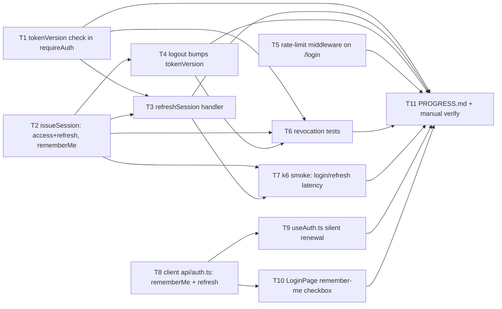

# Task divide — remember-me

<!-- Stage 08 → see skills/divide-tasks/SKILL.md -->

## Upstream artefacts

- PRD: [[../PRD.md]] (US-01..US-06, AC-01..AC-07, §6 NFR)
- SAD: [[../sad.md]] (§5 Building blocks, §6 Runtime — 4 Critical flows + 6 endpoint-level
  sequences)
- ADRs: [[../adr/0001-extend-tokenversion-counter-to-cover-logout.md]],
  [[../adr/0002-issue-a-separate-refresh-token-for-remembered-sessions.md]],
  [[../adr/0003-mongo-backed-counter-for-login-rate-limiting.md]]
- Data model: [[../data-model.md]] — `User.tokenVersion` (Phase 1) and `LoginAttempt` **already
  implemented** (stage 06, commit `fc60514`) — no migration/schema task in this breakdown.
- API contract: [[../contracts/openapi.yaml]] + [[../contracts/api-sync-report.md]]

## What's already done (not re-listed as tasks)

- `src/models/User.ts` — `tokenVersion: { type: Number }` (optional, Phase 1 of 3).
- `src/models/LoginAttempt.ts` — new collection, TTL index.

Everything below is net-new application code: `requireAuth` doesn't check `tokenVersion` yet,
`issueSession` doesn't know about `rememberMe` or refresh tokens yet, no rate-limit middleware
exists yet, and the client doesn't send `rememberMe` or call `/refresh` yet.

## Dependency graph

`T8` depends only on the already-frozen `openapi.yaml` contract, not on the backend tasks landing
first — the client can build and be smoke-tested against the Prism mock (`npm run mock:api`)
in parallel with `T1`-`T5`.

## Tasks

See `tracker.md` for the status table; one story file per task under this directory.

| ID | Title |
|----|-------|
| T1 | [tokenVersion check in requireAuth](t1-tokenversion-check-requireauth.md) |
| T2 | [issueSession: access+refresh tokens, rememberMe param](t2-issuesession-refresh-rememberme.md) |
| T3 | [POST /api/auth/refresh handler](t3-refresh-session-handler.md) |
| T4 | [logout bumps tokenVersion](t4-logout-bumps-tokenversion.md) |
| T5 | [Login rate-limit middleware (LoginAttempt)](t5-login-rate-limit-middleware.md) |
| T6 | [Backend revocation tests (QG-1)](t6-revocation-tests.md) |
| T7 | [k6 latency smoke test (QG-2)](t7-k6-latency-smoke.md) |
| T8 | [client api/auth.ts: rememberMe + refresh](t8-client-api-auth.md) |
| T9 | [useAuth.ts silent access-token renewal](t9-useauth-silent-renewal.md) |
| T10 | [LoginPage: "remember me" checkbox](t10-loginpage-checkbox.md) |
| T11 | [PROGRESS.md update + manual verification against live Mongo](t11-progress-and-manual-verify.md) |
