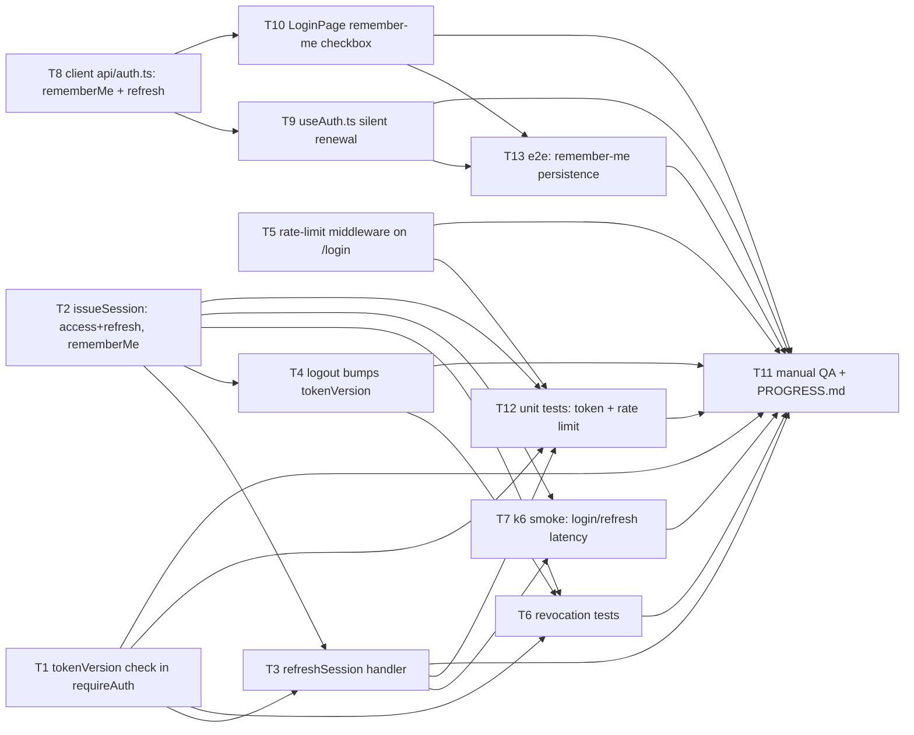

# Task divide — remember-me

<!-- Stage 08 → see skills/divide-tasks/SKILL.md -->

## Upstream artefacts

- PRD: [../PRD.md](../PRD.md) — AC-01..AC-07, NFR (§6)
- SAD: [../sad.md](../sad.md) — §5 building blocks, §6 runtime (4 Critical flows + US-01..US-06
  sequences), §9 ADR index, §10 quality requirements
- ADR-0001 (Accepted): [../adr/0001-extend-tokenversion-counter-to-cover-logout.md](../adr/0001-extend-tokenversion-counter-to-cover-logout.md)
- ADR-0002 (Accepted): [../adr/0002-issue-a-separate-refresh-token-for-remembered-sessions.md](../adr/0002-issue-a-separate-refresh-token-for-remembered-sessions.md)
- ADR-0003 (Accepted): [../adr/0003-mongo-backed-counter-for-login-rate-limiting.md](../adr/0003-mongo-backed-counter-for-login-rate-limiting.md)
- Data model: [../data-model.md](../data-model.md) — `User.tokenVersion`, new `LoginAttempt` collection
- API contract: [../contracts/openapi.yaml](../contracts/openapi.yaml) — 5 endpoints

## Already done (not listed as tasks)

`src/models/User.ts` (`tokenVersion` field, Phase 1 of 3) and `src/models/LoginAttempt.ts` were
already implemented during stage 06 (commit `fc60514`) — no migration/schema task in this
breakdown. Every task below is net-new application code: `requireAuth` doesn't check
`tokenVersion` yet, `issueSession` doesn't know about `rememberMe` or refresh tokens yet, no
rate-limit middleware exists yet, and the client doesn't send `rememberMe` or call `/refresh` yet.

## Dependency graph

## Tasks

| ID | Title | DoR | DoD | Deps | Estimate | Owner |
|----|-------|-----|-----|------|----------|-------|
| T1 | [requireAuth: tokenVersion check](./require-auth-tokenversion.md) | ADR-0001 Accepted | PR merged, unit tests green | — | S | Tanya19Lion |
| T2 | [issueSession: access+refresh tokens, rememberMe param](./issue-session-refresh-tokens.md) | ADR-0002 Accepted | PR merged, unit tests green | — | M | Tanya19Lion |
| T3 | [POST /api/auth/refresh handler](./route-refresh-session.md) | T1, T2 done | PR merged, matches openapi.yaml (200/401/4XX) | T1, T2 | M | Tanya19Lion |
| T4 | [logout bumps tokenVersion](./logout-tokenversion-bump.md) | T2 done | PR merged, replay test passes | T2 | S | Tanya19Lion |
| T5 | [Login rate-limit middleware (LoginAttempt)](./login-rate-limit-middleware.md) | ADR-0003 Accepted | PR merged, 429 on 6th attempt | — | M | Tanya19Lion |
| T6 | [Integration test: session revocation (QG-1)](./integration-test-session-revocation.md) | T1, T2, T4 done | tests green, both replay assertions pass | T1, T2, T4 | M | Tanya19Lion |
| T7 | [k6 latency smoke test (QG-2)](./k6-latency-smoke.md) | T2, T3 done | p95 targets met or documented | T2, T3 | S | Tanya19Lion |
| T8 | [client api/auth.ts: rememberMe + refresh](./client-api-auth.md) | openapi.yaml frozen | PR merged, tsc green, smoke-tested against Prism mock | — | S | Tanya19Lion |
| T9 | [useAuth.ts silent access-token renewal](./client-silent-token-renewal.md) | T8 done | PR merged, renewal + expiry UX both verified | T8 | M | Tanya19Lion |
| T10 | [LoginPage: "remember me" checkbox](./client-loginpage-remember-me-checkbox.md) | T8 done | PR merged, checkbox wired end-to-end | T8 | S | Tanya19Lion |
| T11 | [Manual QA: live-Mongo verification + PROGRESS.md update](./manual-qa-live-verification.md) | T1, T3, T4, T5, T6, T7, T9, T10, T12, T13 done | all 7 AC confirmed live, PROGRESS.md updated | T1, T3, T4, T5, T6, T7, T9, T10, T12, T13 | S | Tanya19Lion |
| T12 | [Unit tests: tokenVersion check, session issuance, refresh expiry (QG-3), rate limit](./unit-tests-token-and-rate-limit.md) | T1, T2, T3, T5 done | tests green, covers QG-3 explicitly | T1, T2, T3, T5 | S | Tanya19Lion |
| T13 | [E2E: remember-me persistence (AC-01, AC-02)](./e2e-remember-me-persistence.md) | T9, T10 done | e2e green for both checked/unchecked branches | T9, T10 | S | Tanya19Lion |

## Estimation legend

- XS: ≤2h
- S: ≤1d
- M: 1-2d (borderline — consider splitting)
- L: must be split, ≤1d did not work out

## Notes

- Effort budget (SAD §2 Organisational): feature_size M, "larger than a single engineer's typical
  S-size scope" after the ADR-0002 override. Sum of estimates above (~9-10d at S≈1d, M≈1.5d) is
  consistent with that sizing.
- `T8` depends only on the already-frozen `openapi.yaml` contract, not on the backend tasks
  landing first — the client can build and be smoke-tested against the Prism mock
  (`npm run mock:api`) in parallel with `T1`-`T5`.
- No migration task: `User.tokenVersion` and `LoginAttempt` schema changes already shipped in
  stage 06 (commit `fc60514`) — see "Already done" above.
- `T9`'s exact renewal-trigger mechanism (timer vs. query-driven) is left as an open
  implementation decision in its own story file, not resolved here — it affects
  `JWT_EXPIRES_IN` coupling between client and server and deserves its own review comment, not a
  silent pick.
- **Test layer, corrected 2026-09-10:** the first pass of this breakdown only had one dedicated
  test task (T6, integration) and embedded unit-test assertions inline inside T1/T2/T5's own DoD
  instead of a separate task, and had no e2e task at all — inconsistent with `forgot-password`'s
  T12 (dedicated unit-test file) / T16 (e2e) pattern, and missing SAD §10 QG-3's own explicit
  "How verify: unit test" requirement (the server-clock-only expiry check) entirely. T12 and T13
  above close both gaps; T1/T2/T3/T5's DoD now reference T12 instead of embedding unit-test
  bullets.
