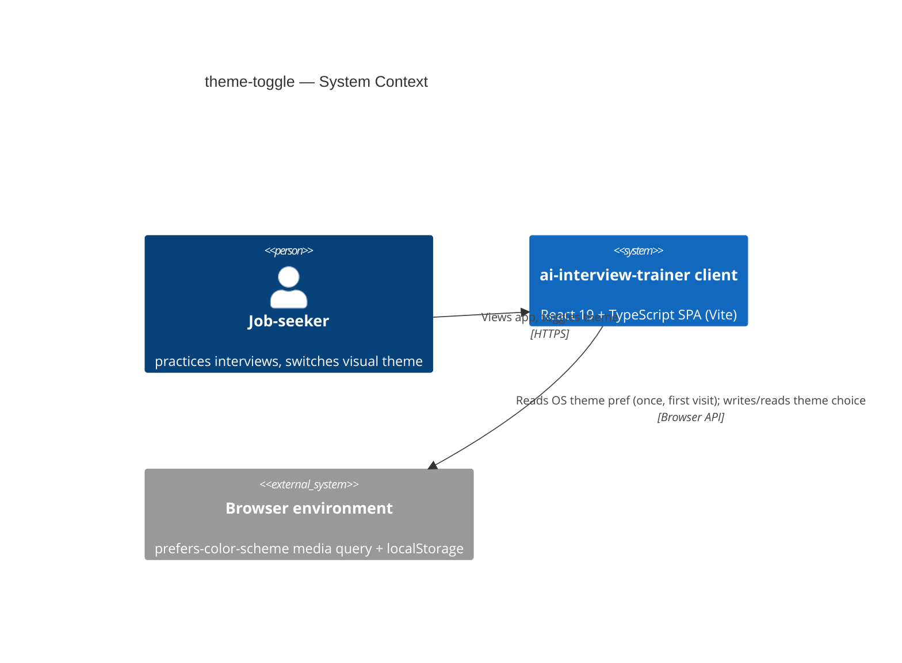
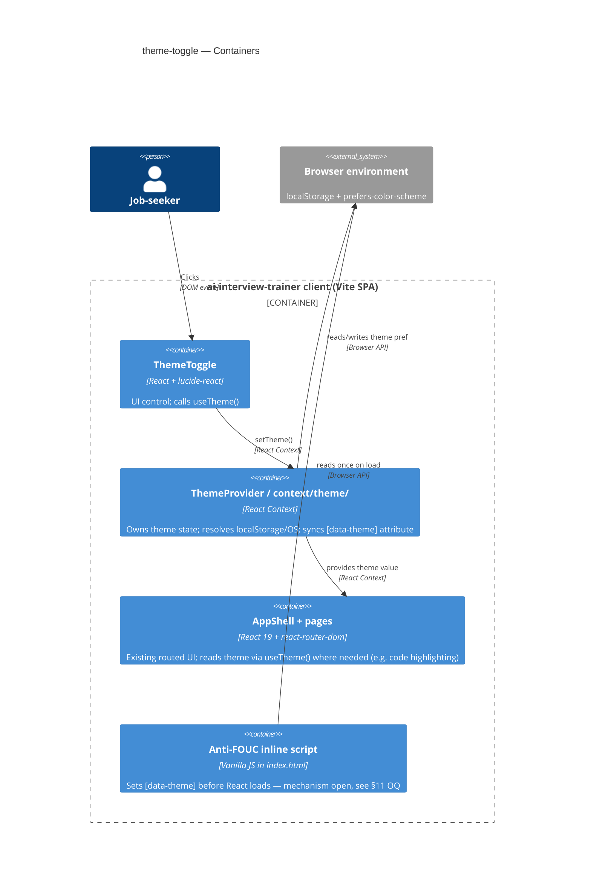
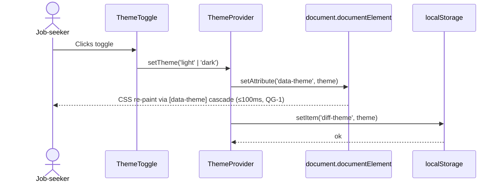

# Software Architecture Document — theme-toggle

<!-- Stages 04-05 → see sdlc/plugin/skills/architecture-design/SKILL.md -->
<!-- 12 Arc42 sections. Empty sections — <!-- N/A: <one-line reason> -->. -->
<!-- C4 Context (L1) lives inline in §3. C4 Container (L2) lives inline in §5. -->
<!-- Заповнений приклад: див examples/course-lesson-mvp/sad.md у sdlc/ toolkit. -->

## 1. Introduction and goals

<!-- 🎯 Навіщо: стабільна памʼять про «що + три головні якості + хто зацікавлений».     -->
<!--           Через рік ніхто не згадає на словах, ЯКІ ТРИ ЯКОСТІ для системи критичні. -->
<!-- 📋 Що писати: 1 абзац intent + 3 рядки топ-3 якості + таблиця stakeholders.        -->
<!-- 📌 Приклад: «QG-1: швидкість редагування блоку p95 ≤500 мс»                         -->

**Intent.** Job-seekers practicing interviews in ai-interview-trainer get a manual light/dark theme toggle with no page reload; a new visitor's first render already matches their OS-level theme preference (one-time read, no ongoing sync); the chosen theme persists per-device across sessions. This is the last polish item before the v1 release (~2026-10-05) — all 10 client-plan tasks are already shipped per PROGRESS.md (PRD §1).

**Top-4 quality goals (1-liners; full scenarios in §10):**

1. Perceived switch performance — visual latency ≤100 ms from click to full re-paint (PRD §6 NFR).
2. Cold-load correctness — ≤16 ms to first paint already in the correct theme, no flash-of-unstyled-content (FOUC) (PRD §6 NFR).
3. Persistence accuracy — 100% of returning visits on the same device/browser render the last manually chosen theme (PRD §6 NFR).
4. AI-feedback readability across themes — text, code highlighting, and strength/weakness badges stay readable (WCAG AA contrast) in both light and dark; PRD §7 KPI names this the single most critical risk (idea-brief §10), so it is promoted to a top-level quality goal rather than left as an inline note.

**Stakeholders.**

| Role | Interest | Sign-off owner? |
|---|---|---|
| Job-seeker | Switches theme, expects readable AI feedback in either mode | No |
| Tech Lead | SAD approval; owns WCAG AA contrast audit for AI feedback in both themes (§8, resolves PRD §8 open question — original "before architecture-design" deadline re-anchored to "before this SAD's finalization commit, Step 8") | Yes |

**Decision overrides:**
- None yet in this SAD — PRD §1 ¶4 override (authorization coverage-type N/A) carries forward unchanged; no new override introduced in §1.

## 2. Constraints

<!-- 🎯 Навіщо: §4 (стратегія) працює тільки коли §2 зафіксувала, ЩО ВЖЕ ЗАФІКСОВАНО:    -->
<!--           стек, версії, дедлайн, регуляторні вимоги. Це вхід, не вихід.             -->
<!-- 📋 Що писати: чотири блоки — Технічні / Організаційні / Конвенції / Регуляторні.     -->
<!-- 📌 Приклад: «Postgres 18» (не «Postgres»); «дедлайн Q3 — жорсткий» (не «бажано»).    -->

**Technical.**
- TypeScript ~6.0.2, React ^19.2.8 + react-dom ^19.2.8, Vite ^8.2.0, @vitejs/plugin-react ^6.0.4 (`client/package.json`)
- Purely client-side feature — no changes to the root Express + TypeScript + MongoDB (Mongoose) backend (`ai-interview-trainer-server`)
- Existing deps available for reuse: `lucide-react` (icon library, currently used only in `PasswordField`), `framer-motion` (available for transition, not currently used for theming)
- Component convention: `components/<Name>/<Name>.tsx` + co-located `.module.css`, re-exported via `components/index.ts`

**Organisational.**
- Feature size S (PRD frontmatter)
- Soft deadline: next natural polish item before v1 release (~2026-10-05, per PROGRESS.md — all 10 client-plan tasks already shipped)
- Team: implicitly 1 frontend engineer (client work to date has been single-owner per PROGRESS.md)

**Conventions.**
- `.claude/rules/frontend/styles.md` — `client/src/styles/tokens.css` is the single source of truth for color/typography/spacing/radii; components read `var(--token-name)`, never hardcode values
- No existing React Context or global-UI-state hook pattern in `client/src` (Explore report) — auth state is server-derived via TanStack Query, not client state; a theme mechanism sets a new precedent (resolved in §5)
- localStorage: one existing usage (`LangOverlay`, key `'diff-lang-chosen'`, inline `getItem`/`setItem`, no wrapper utility) — sets a `'diff-<feature>'` kebab-case key-naming precedent

**Regulatory / external.**
- PRD §6.1: Data classification = Internal; theme preference is a non-PII local string, not sent to the backend, not linked to an account
- No new authz/authn boundary, no new server endpoint — Security review marked N/A in PRD §6.1 (S-size, purely client-side cosmetic feature)

## 3. Context and scope

<!-- 🎯 Навіщо: малює КОРДОН СИСТЕМИ — хто з нею говорить ззовні, де закінчується зона довіри. -->
<!--           Без §3 §5 і §8 (авторизація) розпливаються — неясно, що «всередині», а що «зовні». -->
<!-- 📋 Що писати: 2-3 речення бізнес-контексту + таблиця зовнішніх систем + Mermaid C4Context. -->
<!-- 📌 Приклад: «зовнішні — нема (свідома відмова від third-party у v1)» — це теж рішення.   -->
<!-- Кордон довіри (trust boundary) — лінія, за якою ти не довіряєш даним без перевірки.       -->

Job-seeker interacts with `ai-interview-trainer` through a React SPA (`client/`) in the browser. This feature is purely client-side: no new traffic to the backend (root Express + Mongoose), no new endpoint. The only "external" interaction is reading `prefers-color-scheme` from the browser/OS once on first visit, and writing/reading the chosen theme in browser localStorage.

**External systems (in / out):**

| Actor or system | Type | Interaction |
|---|---|---|
| Job-seeker | Person | Views the app, toggles theme |
| Browser environment (OS theme + localStorage) | System (external) | Provides `prefers-color-scheme` (once, first visit); stores/returns the chosen theme preference |

**C4 Context (L1):**



## 4. Solution strategy

<!-- 🎯 Навіщо: 3-4 СТРАТЕГІЧНІ СТОВПИ, з яких потім ростуть усі ADR. Без §4 кожен ADR    -->
<!--           виглядає випадковим — нема зонтика. ⭐ Найгустіша секція — тут ADR-gate    -->
<!--           спрацьовує майже завжди (рішення незворотні + мульти-модульні).            -->
<!-- 📋 Що писати: список з 3-4 виборів. На кожен — заголовок + 2-3 речення rationale.    -->
<!-- 📌 Приклад: «Зберігати урок як таблицю блоків» — стовп, з якого виросло ADR-0001.    -->

**Top-3 strategic choices (the seeds for ADRs):**

1. **React Context for theme state distribution** — a new `ThemeContext` + `ThemeProvider` composed in `main.tsx` gives every component a typed `useTheme()` read, needed by code-highlighting components that must pick a syntax-theme variant in JS (QG-4 readability), at the cost of a re-render fan-out on toggle (tracked against QG-1's ≤100 ms latency in §10). First such Context precedent in this codebase — see **ADR-0001**.
2. **Anti-FOUC cold-load strategy — open.** How the correct theme is applied before React hydrates (inline `<head>` script vs. `useLayoutEffect`) is deferred; see §11 Open Decisions (owner: Tech Lead, due: before `sdlc:break-tasks`). This choice must be locked before `sdlc:break-tasks` because it determines whether a tactical task exists for editing `client/index.html` outside the normal React/TypeScript source tree.
3. **Storage-override theme-resolution logic (no separate manual-choice flag)** — `localStorage` stores only the resolved `'light'|'dark'` value, written solely on manual toggle. Resolution order at every load: valid stored value present → use it, ignore OS; otherwise → compute live from `prefers-color-scheme`, never persisted. This single rule satisfies AC-02 (corrupt/missing value falls back to smart default), AC-03 (manual choice outranks later OS changes — no separate `isManual` flag needed, since presence of a stored value *is* the manual-choice signal), and AC-06 (first-visit smart default) without extra state. Low blast radius (single function, easy to relearn) — decided inline, no ADR.

Each tactical decision in later sections should be traceable to one of these strategic seeds. Tactical decisions that *contradict* a strategic choice are red flags — surface them in §11 Risks.

## 5. Building block view

<!-- 🎯 Навіщо: ВНУТРІШНЯ ДЕКОМПОЗИЦІЯ — модулі, контейнери, БД. Статична топологія:   -->
<!--           хто з ким може говорити. Без §5 §6 (сценарії) не має словника учасників. -->
<!-- 📋 Що писати: 1 абзац про стиль (шари/гексагональна/clean/на подіях) +            -->
<!--           дерево папок + Mermaid C4Container.                                       -->
<!-- 📌 Приклад: «web-app, content-api, media-worker, postgres, s3, cdn».                -->

React feature-folder style (not layered/hexagonal — that convention is backend-only per CLAUDE.md). `client/src/` groups by concern: `components/` (one folder per UI component, co-located `.module.css`), `hooks/` (React hooks — historically TanStack Query wrappers only), `lib/` (pure, state-free helpers), `styles/` (design tokens). This feature introduces the first shared-UI-state module in the codebase (ADR-0001) and a new top-level grouping convention to hold it.

**Internal decomposition:**

```
client/src/
├── context/theme/
│   ├── ThemeContext.tsx     <React.createContext<ThemeContextValue>>
│   ├── ThemeProvider.tsx    <resolves localStorage/OS on mount, exposes setTheme(), owns [data-theme] sync>
│   └── useTheme.ts          <useContext(ThemeContext) wrapper hook>
├── components/ThemeToggle/
│   ├── ThemeToggle.tsx      <calls useTheme(); reuses buttonClassName({variant:'ghost'}) from components/Button>
│   └── ThemeToggle.module.css
└── styles/tokens.css        <extended with [data-theme="light"] override block, per ADR to be spawned in §8>
```

`ThemeToggle` reuses the existing `buttonClassName({variant: 'ghost', size: 'md'})` helper (Explore report — same convention `PasswordField`'s show/hide control follows) and `lucide-react` `Sun`/`Moon` icons (already a dependency, currently only used in `PasswordField`) — no new UI-library dependency needed.

**C4 Container (L2):**



## 6. Runtime view

<!-- 🎯 Навіщо: ПОТІК У RUNTIME для 1-2 критичних сценаріїв. Хто з ким коли і у якому     -->
<!--           порядку говорить. Без §6 §5 — лише купа коробок без життя.                  -->
<!-- 📋 Що писати: Mermaid sequenceDiagram. Учасники — імена з §5 (не вигадуй нові!).      -->
<!--           Повідомлення семантичні («складає чорновик»), БЕЗ HTTP-методів/шляхів —     -->
<!--           ендпоінт-рівневі sequence-діаграми зʼявляться у stage 06 (define-api).      -->
<!-- 📌 Приклад: «methodist → web-app: складає чорновик → web-app → content-api: зберегти». -->

**Critical flow 1: Manual theme toggle (AC-01, AC-03)**



**Critical flow 2: First-visit smart default (AC-06, AC-02)**

```mermaid
sequenceDiagram
    actor Jobseeker as Job-seeker
    participant FoucScript as Anti-FOUC inline script
    participant Storage as localStorage
    participant Browser as Browser (prefers-color-scheme)
    participant DOM as document.documentElement
    participant Provider as ThemeProvider

    Jobseeker->>FoucScript: First page load
    FoucScript->>Storage: getItem('diff-theme')
    alt valid stored value present
        Storage-->>FoucScript: 'light' | 'dark'
    else missing or corrupted (AC-02)
        Storage-->>FoucScript: null / invalid
        FoucScript->>Browser: matchMedia('(prefers-color-scheme: dark)')
        Browser-->>FoucScript: dark | light
    end
    FoucScript->>DOM: setAttribute('data-theme', resolvedTheme) — before React hydrates (≤16ms, QG-2)
    Note over Provider: React hydrates; ThemeProvider re-runs the same resolution logic to sync its own state with the DOM attribute already set
    Provider-->>Jobseeker: Correct theme visible from first paint, no flash
```

## 7. Deployment view

<!-- 🎯 Навіщо: ТОПОЛОГІЯ, яку DevOps має знати без читання Helm-чартів — скільки реплік,  -->
<!--           де живе фоновий обробник, ПРИ ЯКИХ ЧИСЛАХ масштабуємось.                     -->
<!-- 📋 Що писати: 2-3 речення про топологію + метрики + алерти + конкретні числа-пороги.   -->
<!-- 📌 Приклад: «500 IC → партиціонування за кварталом» (не «при зростанні подумаємо»).    -->
<!-- 🎯 Можна N/A для XS/S функцій, що переюзають існуюче розгортання без змін.            -->

<!-- N/A: feature reuses existing deployment unit, no replica/scaling/monitoring change -->

## 8. Crosscutting concepts

<!-- 🎯 Навіщо: НАСКРІЗНІ ПАТЕРНИ, які перетинають кілька модулів: логування, помилки,    -->
<!--           авторизація, ID strategy, outbox, кеш. ⭐ Друга найгустіша секція.          -->
<!--           Якщо патерн всередині одного модуля — він НЕ сюди. Якщо це конвенція        -->
<!--           проєкту в цілому — у CLAUDE.md.                                              -->
<!-- 📋 Що писати: таблиця концепт / конвенція / де визначено. Один рядок на концепт.      -->
<!-- 📌 Приклад: «UUID v7 (час+випадковий, сортується) у app-layer» — як default з CLAUDE.md. -->

| Concept | Convention | Where defined |
|---|---|---|
| Logging | N/A — no client structured-logging convention exists; localStorage read failures are handled silently, not logged (AC-02) | — |
| Internationalisation | Toggle label / aria-label localized via existing `react-i18next` (`locales/uk`, `locales/en`) | `client/src/locales/` |
| Error handling | Corrupted/missing localStorage value → falls back to `prefers-color-scheme`, no thrown error, no user-facing error state (AC-02) | §4 (storage-override logic) |
| ID strategy | N/A — no new entities/records introduced | — |
| Accessibility / contrast | WCAG AA contrast audit of AI feedback (text, code highlighting, badges) across both themes — owner: Tech Lead, due: before this SAD's finalization commit (Step 8); resolves PRD §8 open question | §1 Stakeholders |
| Observability | N/A — no production monitoring added (§7) | — |
| Abuse mitigation | Client-side debounce on the toggle handler mitigates rapid-toggle-spam re-render abuse (PRD §6.1); no server-side rate limit applies — there is no request to rate-limit | PRD §6.1 |

## 9. Architecture decisions

<!-- 🎯 Навіщо: ЗВОРОТНИЙ ІНДЕКС на папку adr/. `ls adr/` дає файли, §9 дає семантику —    -->
<!--           чому вони існують, до якого зрізу SAD привʼязані, у якому статусі.           -->
<!-- 📋 Що писати: таблиця з 4 колонками. Один рядок на ADR. Mixed status — це OK.         -->
<!-- 📌 Приклад: «0001 | Зберігати урок як таблицю блоків | Accepted | §4».                -->

| # | Title | Status | Section |
|---|---|---|---|
| 0001 | Use React Context for theme state | Accepted | §4 |

ADR files live under `docs/features/<slug>/adr/NNNN-<title>.md`.

## 10. Quality requirements

<!-- 🎯 Навіщо: ДЕРЕВО ЯКОСТЕЙ (Quality Tree) — беремо мету з §1 і розкладаємо на          -->
<!--           конкретні листя: тести, метрики, конфіги, drill-и. ⭐ Без §10 §1 — це       -->
<!--           маніфест. З §10 кожна декларація мапиться на щось, ЩО МОЖНА ДОВЕСТИ.        -->
<!-- 📋 Що писати: на кожну якість з §1 — When / Then / How verify. Числа з PRD §6 NFR     -->
<!--           ДОСЛІВНО (не округлюй p95 ≤250мс до ≤300мс — це F6-помилка критика).        -->
<!-- 📌 Приклад: «p95 ≤500 мс на UPDATE блоку, перевіримо k6 load test 100 req/s».        -->

Each top-4 goal from §1 expanded into a full scenario:

**QG-1. Perceived switch performance**
- **When:** Job-seeker clicks the theme toggle
- **Then:** visual re-paint completes ≤100 ms from click (PRD §6 NFR, verbatim)
- **How verify:** manual QA / browser Performance API measurement on click

**QG-2. Cold-load correctness (anti-FOUC)**
- **When:** Job-seeker loads the app cold (first paint)
- **Then:** first paint is already in the correct theme, ≤16 ms from load start, no flash-of-unstyled-content (PRD §6 NFR, verbatim)
- **How verify:** manual QA / browser Performance API on cold load

**QG-3. Persistence accuracy**
- **When:** Job-seeker returns to the app on the same device/browser
- **Then:** 100% of returning visits render the last manually chosen theme (PRD §6 NFR, verbatim)
- **How verify:** e2e test asserting re-render from localStorage (PRD's own measurement method, verbatim)

**QG-4. AI-feedback readability across themes**
- **When:** Job-seeker views AI-generated feedback (text, code highlighting, strength/weakness badges) in either theme
- **Then:** all feedback content remains readable with sufficient WCAG AA contrast in both light and dark themes (PRD §6.1, AC-05)
- **How verify:** manual QA WCAG AA contrast audit before release, owner Tech Lead (§1, §8); target 0 reported readability incidents within 30 days post-release (PRD §7 KPI, verbatim)

## 11. Risks and technical debt

<!-- 🎯 Навіщо: ⭐ збирає ВСЕ, що може зламатись — і не лише технічне. Без §11 ризики   -->
<!--           обговорюються на стендапах і губляться; борг лишається у голові того,    -->
<!--           хто його прийняв.                                                          -->
<!-- 📋 Що писати: таблиця ризик/борг — серйозність — мітигація — власник. Технічний    -->
<!--           борг окремою секцією.                                                      -->
<!-- 📌 Приклад: «EM не пушить — member не оновлює дані | High | …». Перший ризик —      -->
<!--           часто продуктовий, не технічний. Це нормально.                            -->

<!-- Severity column literals: Low / Medium / High for regular risks; "Open question" for rows
     created by Step-7 `Save as Open Question` resolutions (see references/socratic-loop.md). -->

| Risk / debt | Severity | Mitigation | Owner |
|---|---|---|---|
| Open architectural decision: anti-FOUC cold-load strategy (inline `<head>` script vs. `useLayoutEffect`) | Open question | Resolve before `sdlc:break-tasks`; deferred because it commits the project to a hand-written JS shim outside the React/Vite build tree (inline script) vs. a slower-but-pure-React path — needs a decision before tasks reference a concrete file to edit | Tanya19Lion (sole project owner — Tech Lead role) |
| Open architectural decision: exact light-palette colors (PRD §8) — `tokens.css` currently has only a dark-first palette plus fixed `--paper`/`--paper-2` accents, no true light-mode root values | Open question | Resolve before `sdlc:break-tasks` for §5's `tokens.css` `[data-theme="light"]` override block — tasks can't be scoped without concrete color values | Tanya19Lion (sole project owner — Tech Lead role) |
| Open architectural decision: is the ≤100 ms switch-latency NFR (QG-1) a verified realistic threshold or a heuristic estimate? (PRD §8) | Open question | Resolve on the first manual QA pass after implementation — measure actual re-paint latency with the browser Performance API and confirm or renegotiate the NFR empirically, not a priori | Tanya19Lion (sole project owner — Tech Lead role) |
| ADR-0001 introduces the first React Context in `client/src` — re-render fan-out on every toggle could threaten QG-1's ≤100 ms budget if many feedback/code-highlighting components subscribe to theme value | Medium | Keep the Context value minimal (theme string only, no derived objects, no functions recreated per render) to limit unnecessary re-renders; verify against the actual component count during QG-1 manual QA | Tanya19Lion |
| Brownfield drift: this SAD's §2/§5 rely on the Step-3 Explore scan (package versions, folder layout, `tokens.css` contents) captured 2026-09-07 — if the codebase changes materially before implementation starts, those sections may need a fresh scan | Low | Re-run `Explore` before `sdlc:break-tasks` if implementation is delayed by more than a few weeks | Tanya19Lion |

**Accepted debt (acceptable in v1, plan to fix later):**
- No automated e2e coverage for the anti-FOUC script itself (mechanism deferred, see Open Decisions above) — acceptable for v1 given S-size scope; revisit if a second feature also needs to touch `index.html`'s inline script.

## 12. Glossary

<!-- 🎯 Навіщо: ⭐ СЛОВНИК ДОМЕНУ, який припиняє суперечки через рік («checkpoint —      -->
<!--           weekly чи biweekly? Quarter — календарний чи фіскальний?»).                -->
<!-- 📋 Що писати: таблиця термін / значення. Бізнес-терміни + технічні вперемішку.       -->
<!--           Один термін може мати дві мови у заголовку: «Goal (Обʼєктив)».              -->
<!-- 📌 Приклад: «Lesson | урок усередині курсу, що складається з блоків (text, video)». -->

| Term | Meaning |
|---|---|
| <e.g. Goal> | <quarterly intent in statement form> |
| <e.g. KR> | <Key Result — measurable target linked to a Goal> |
| <e.g. Checkpoint> | <bi-weekly progress update on a KR> |