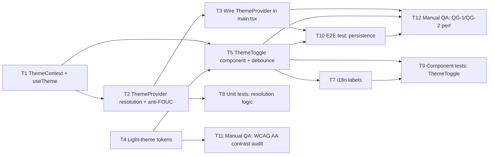

# Task divide — theme-toggle

<!-- Stage 08 → see skills/divide-tasks/SKILL.md -->

## Upstream artefacts

- PRD: [../PRD.md](../PRD.md) — AC-01..AC-06, NFR (§6), security/privacy (§6.1)
- SAD: [../sad.md](../sad.md) — §4 solution strategy, §5 building blocks, §6 runtime, §9 ADR index, §10 quality requirements, §11 risks
- ADR-0001 (Accepted): [../adr/0001-react-context-for-theme-state.md](../adr/0001-react-context-for-theme-state.md) — React Context for theme state

## Open-decision resolution (was blocking this stage)

SAD §11 flagged the anti-FOUC cold-load mechanism as an **open question**, due "before `sdlc:break-tasks`" (this stage). Resolved during this task-divide session:

- **Chosen:** `useLayoutEffect` in `ThemeProvider` (not an inline `<head>` script in `client/index.html`).
- **Rationale (user decision):** keeps the mechanism inside the normal React/TypeScript source tree — no hand-written JS shim outside the build pipeline to maintain.
- **Accepted risk (carried into T12 DoD):** SAD §11 itself notes `useLayoutEffect` runs after React's first render pass, which is a harder path to QG-2's ≤16ms/no-FOUC target than an inline script. T12 (manual perf QA) must explicitly re-verify QG-2 against this choice, not just QG-1.
- **Not yet done:** this resolution lives here in the epic, not back-ported into `sad.md` §11 or into a new ADR. If the team wants it formally recorded upstream, that's a follow-up edit to `sad.md` §11 (or a new ADR if reviewers consider it blast-radius-worthy) — out of scope for `divide-tasks`.

## Dependency graph

## Tasks

| ID | Title | DoR | DoD | Deps | Estimate | Owner |
|----|-------|-----|-----|------|----------|-------|
| T1 | [ThemeContext + useTheme hook](./theme-context-and-hook.md) | ADR-0001 Accepted | PR merged, typecheck green | — | XS | Tanya19Lion |
| T2 | [ThemeProvider: resolution logic + anti-FOUC](./theme-provider-resolution.md) | T1 done | PR merged, unit tests green | T1 | S | Tanya19Lion |
| T3 | [Wire ThemeProvider into main.tsx](./wire-theme-provider.md) | T2 done | PR merged, app boots with no console errors | T2 | XS | Tanya19Lion |
| T4 | [Light-theme design tokens](./light-theme-tokens.md) | SAD §5 token mapping locked | PR merged, `[data-theme="light"]` block matches SAD §5 table | — | S | Tanya19Lion |
| T5 | [ThemeToggle component + rapid-toggle debounce](./theme-toggle-component.md) | T1, T4 done | PR merged, manual click verified in both themes | T1, T4 | S | Tanya19Lion |
| T7 | [i18n labels for ThemeToggle](./theme-toggle-i18n.md) | T5 done | PR merged, uk + en strings render | T5 | XS | Tanya19Lion |
| T8 | [Unit tests: theme resolution logic](./unit-tests-resolution.md) | T2 done | tests cover AC-02, AC-03, AC-06; green | T2 | S | Tanya19Lion |
| T9 | [Component tests: ThemeToggle](./component-tests-toggle.md) | T5, T7 done | tests cover AC-01; green | T5, T7 | S | Tanya19Lion |
| T10 | [E2E test: theme persistence](./e2e-persistence.md) | T3, T5 done | e2e green, asserts QG-3 (PRD §6 measurement method) | T3, T5 | S | Tanya19Lion |
| T11 | [Manual QA: WCAG AA contrast audit](./qa-contrast-audit.md) | T4 done | 0 contrast failures logged, signed off by Tech Lead | T4 | S | Tanya19Lion |
| T12 | [Manual QA: QG-1/QG-2 perf verification](./qa-perf-verification.md) | T3, T5, T10 done | latency + cold-load measurements logged against QG-1/QG-2 thresholds | T3, T5, T10 | XS | Tanya19Lion |

## Estimation legend

- XS: ≤2h
- S: ≤1d
- M: 1-2d (borderline — consider splitting)
- L: must be split, ≤1d did not work out

## Notes

- No migration / domain-entity / repo / service / handler layers — feature is purely client-side (SAD §2, §3); no backend, no `data-model.md`, no `openapi.yaml`.
- T6 number intentionally not used as a separate task: rapid-toggle debounce (PRD §6.1 abuse mitigation) is folded into T5's DoD rather than split into its own task — a few lines inside the same component, splitting further would violate the ≤1-day/atomic-but-not-trivial balance.
- Docs task intentionally omitted: no CHANGELOG/KB convention found for client features in this repo (PROGRESS.md tracks in-flight work, not a per-feature changelog) — flagging this rather than inventing a task against a non-existent convention.
