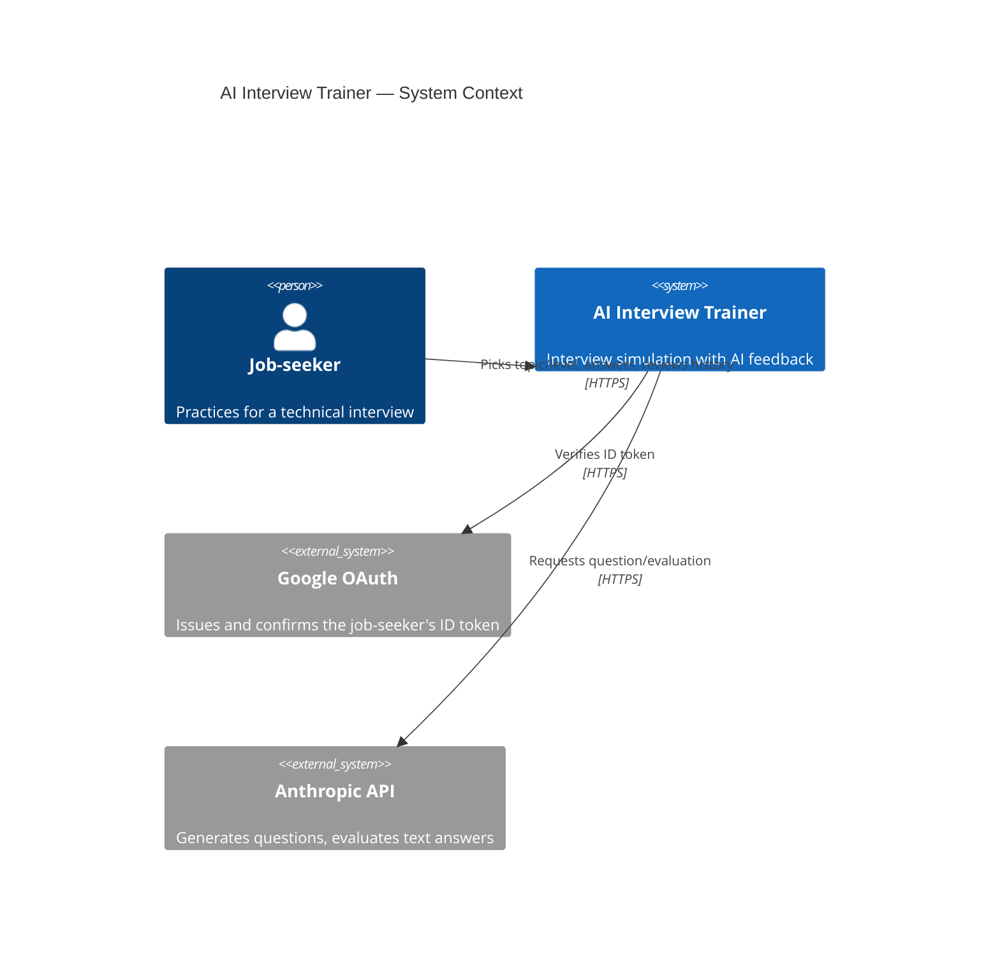
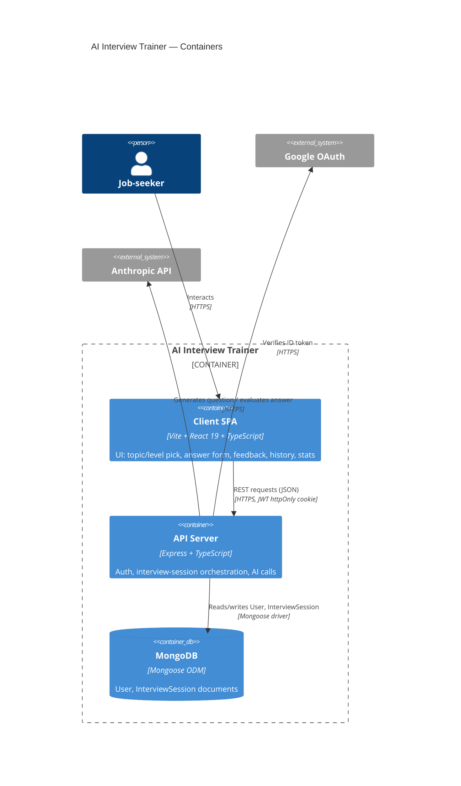
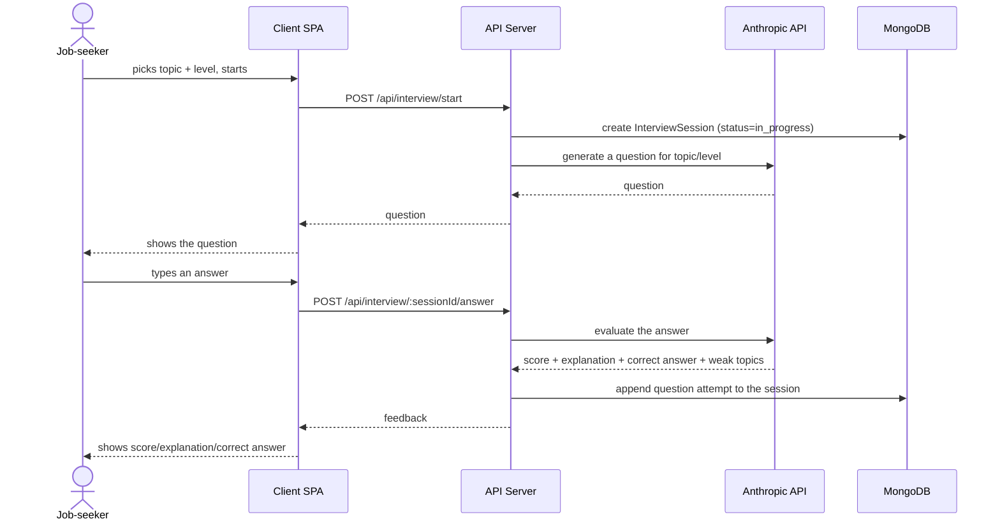
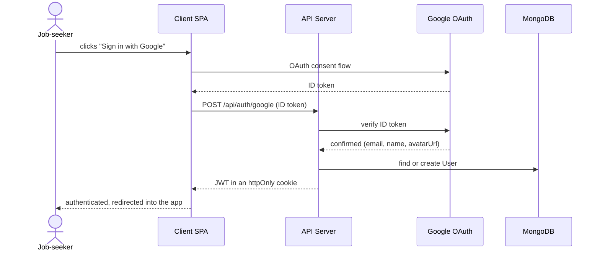
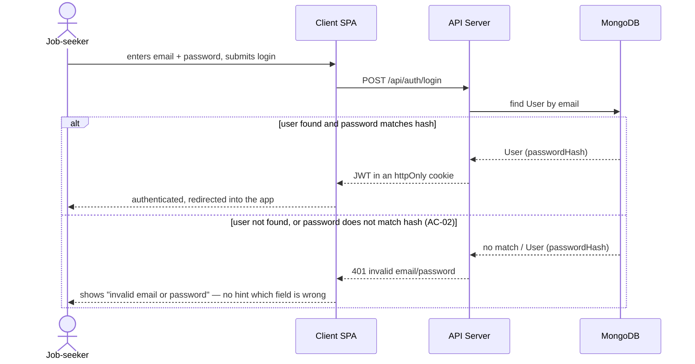
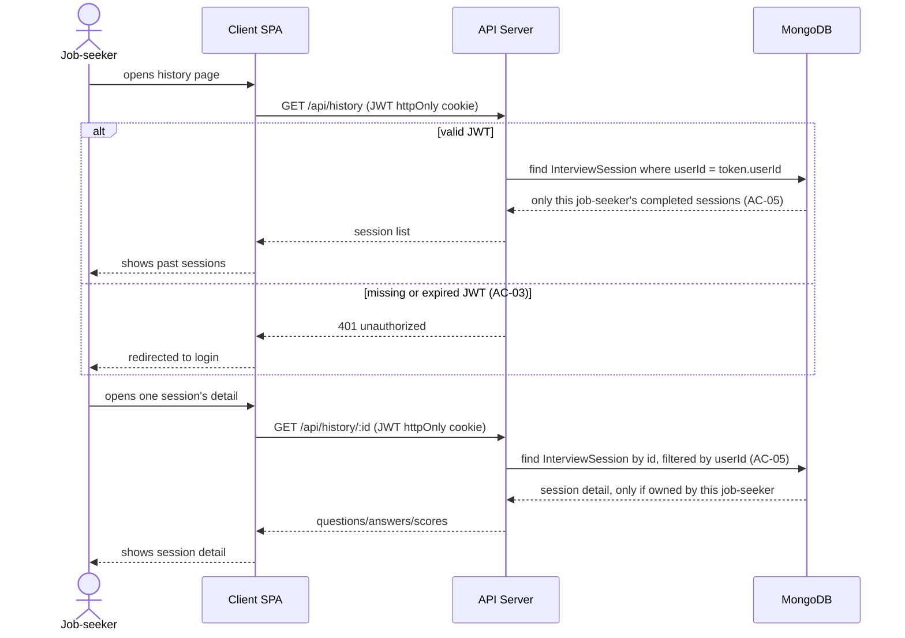
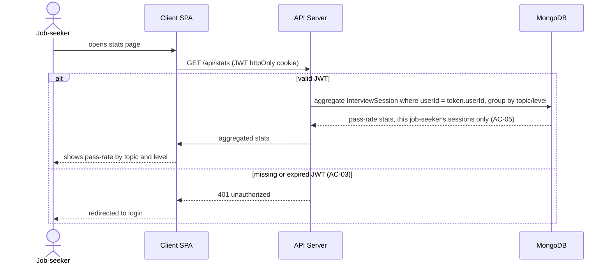
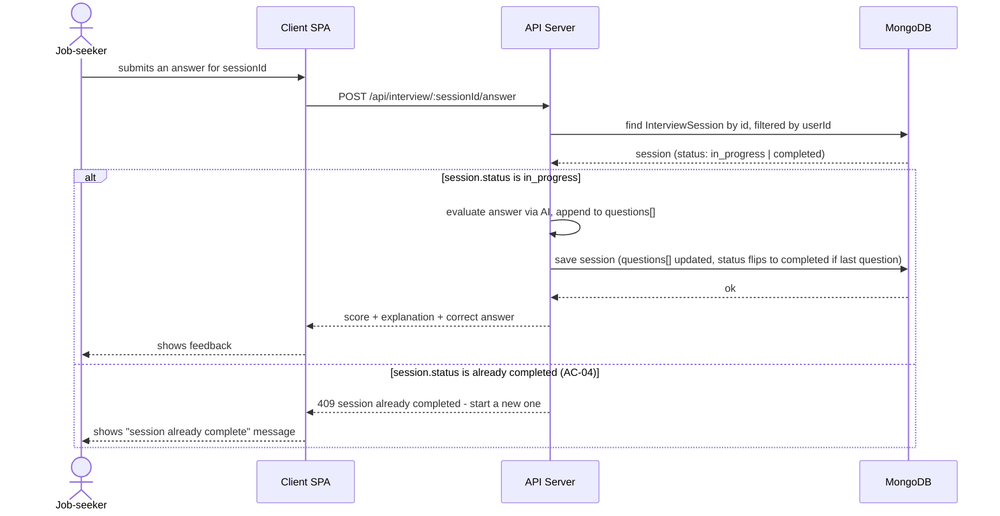

# Software Architecture Document — AI Interview Trainer

<!-- Project-level SAD (not feature-scoped) — see /skills/architecture-design/SKILL.md for the
     per-feature protocol this borrows its structure from. Written as a retrofit against the
     already-built app, without running that skill's Socratic/critic pipeline (there is no
     project-wide idea-brief.md/PRD.md pair to draft it off of — see docs/PRD.md's own note). -->
<!-- 12 Arc42 sections. Empty sections — <!-- N/A: <one-line reason> -->. -->
<!-- C4 Context (L1) lives inline in §3. C4 Container (L2) lives inline in §5. -->

## 1. Introduction and goals

**Intent.** AI Interview Trainer lets a job-seeker practice technical interviews: pick a topic
and a level, get AI-generated questions, submit text answers, and get structured AI feedback
(score, explanation, correct answer, weak topics), with persistent history and stats (PRD §1).

**Top-3 quality goals:**

1. AI-provider replaceability — swapping or adding an AI SDK must not touch controllers/routes,
   only `src/services/ai.service.ts`.
2. Client/server independence — `client/` and `src/` share no type package; a domain change is
   applied by hand on both sides, guarded by a pre-commit check, not by architectural coupling.
3. Authentication safety — no protected route (`/api/interview`, `/api/history`, `/api/stats`)
   performs an action without a valid JWT; data is always filtered by owner (`userId`), never by
   data taken from the request body.

**Stakeholders.**

| Role | Interest | Sign-off owner? |
|---|---|---|
| Job-seeker | Runs sessions, reads feedback/history/stats | No |
| Maintainer (Tanya19Lion) | Sole owner of client and server; approves architectural decisions | Yes |

## 2. Constraints

**Technical.**
- Node.js + TypeScript 5.7, `type: module` (ESM) on the backend.
- Express 4.21, Mongoose 8.9 (MongoDB) on the backend.
- React 19.2 + Vite + TypeScript on the client (`client/`), separate `package.json`.
- Layered backend convention: `routes → controllers → services → models` (§5, ADR-0001).
- ESLint 9 + Prettier on the backend, `oxlint` on the client; Vitest for server unit tests.
- Husky pre-commit hook (`check_enums.py`) blocks a commit if the `TOPICS`/`LEVELS` enums drift
  between `client/src/types/interview.ts` and `src/models/InterviewSession.ts`.

**Organisational.**
- One maintainer runs both client and server — over-abstractions (microservices, a GraphQL
  layer, a shared-types monorepo package) were deliberately rejected as adding coordination cost
  with no current payoff (ADR-0001).
- No formal deadline or fixed hour budget as of this document.

**Conventions.**
- `CLAUDE.md` (repo root) — source of truth for where things live (`src/` server, `client/`
  client) and which verification commands to run.
- `.claude/rules/backend/` and `.claude/rules/frontend/` — path-scoped convention detail,
  auto-loaded when reading matching files.

**Regulatory / external.**
- N/A — the app touches no regulated data category (payments, health data); it stores only a
  job-seeker's email/name/avatar and their answer text. No formal GDPR/SOC2 analysis has been
  done (PRD §6.1).

## 3. Context and scope

A job-seeker interacts with the system through a browser (client `client/`), which talks to the
server (`src/`) only over HTTP (`VITE_API_URL`). The server in turn depends on two external
systems: Google (OAuth token verification at login) and the Anthropic API (question generation
and answer evaluation). MongoDB is the system's datastore, shown at container level (§5), not as
an external system here.

**External systems (in / out):**

| Actor or system | Type | Interaction |
|---|---|---|
| Job-seeker | Person | Picks topic/level, submits answers, reviews history/stats |
| Google OAuth | System (external) | Issues an ID token the server verifies via `google-auth-library` against `GOOGLE_CLIENT_ID` |
| Anthropic API | System (external) | Generates questions for a topic/level and evaluates text answers |

**C4 Context (L1):**



## 4. Solution strategy

**Top-3 strategic choices:**

1. **Layered Express backend with an isolated AI service** — `routes` only bind path+method to
   `controllers`, `controllers` parse request/response with no AI business logic, all Anthropic
   SDK work lives in `services/ai.service.ts`. This gives provider replaceability (quality goal
   #1) without touching the HTTP layer.
2. **Separate client and server with no shared type package** — `client/` and `src/` type the
   interview domain independently (`client/src/types/interview.ts` vs. the Mongoose schemas in
   `src/models/InterviewSession.ts`), connected only over HTTP. The trade-off is deliberate
   (ADR-0001): a single maintainer, monorepo tooling would add cost with no payoff at this
   scale; enum-drift risk is mitigated by a pre-commit hook, not by architecture.
3. **MongoDB / Mongoose with no formal migrations** — a document-oriented model fits "a session
   holding an array of question attempts" whose shape changes more often than a rigid relational
   schema would allow this early in the product's life; `make migrate` stays a placeholder until
   the schema stabilizes (ADR-0001).

Each tactical decision below (§5–§8) traces back to one of these three pillars.

## 5. Building block view

The server is a classic layered Express backend; the client is a standard Vite React SPA.
Dependencies flow one way: `routes → controllers → services → models` (dependency rule, §8).

**Internal decomposition (server, `src/`):**

```
src/
├── routes/        HTTP routes — only bind path+method → controller (+ middleware)
├── controllers/   parse request/response, call services/models, no AI business logic
├── services/      business logic not tied to HTTP (ai.service.ts — Anthropic SDK)
├── models/        Mongoose schemas and MongoDB access (User, InterviewSession)
├── middleware/    cross-cutting concerns (auth.ts — JWT check)
└── config/        external-connection init (db.ts — MongoDB connect)
```

**Internal decomposition (client, `client/src/`):**

```
client/src/
├── api/           HTTP client to the server
├── hooks/         data + state
├── pages/         routed screens
├── components/    UI components (AnswerForm, QuestionCard, FeedbackCard, HistoryTable, ...)
├── types/         client-side domain, manually duplicated from the Mongoose schemas
└── locales/       i18n strings
```

**C4 Container (L2):**



**API routes (current state, `src/index.ts`):**

| Route | Guard | Purpose |
|---|---|---|
| `POST /api/auth/google` | Public | Google OAuth login |
| `POST /api/auth/register` | Public | Email/password registration |
| `POST /api/auth/login` | Public | Email/password login |
| `POST /api/auth/logout` | Public | Logout (clears cookie) |
| `GET /api/auth/me` | `requireAuth` | Current job-seeker |
| `GET /api/interview/active` | `requireAuth` | Active, uncompleted session |
| `POST /api/interview/start` | `requireAuth` | Start a new session (topic+level) |
| `POST /api/interview/:sessionId/answer` | `requireAuth` | Submit an answer, get feedback |
| `GET /api/history` | `requireAuth` | List the job-seeker's completed sessions |
| `GET /api/history/:id` | `requireAuth` | One session's detail |
| `GET /api/stats` | `requireAuth` | Aggregated stats by topic/level |
| `GET /health` | Public | Liveness check |

## 6. Runtime view

**Critical flow 1: answering a question in a session**



**Critical flow 2: authentication via Google OAuth**



### US-04: Authenticate via email/password



### US-05: Review interview history



### US-06: See stats



### Ad-hoc: submit answer to a completed session (AC-04)

> Documents PRD AC-04. `submitAnswer` (`src/controllers/interview.controller.ts`) returns
> `409` for the `else` branch below as of 2026-09-07 — see
> `_audit/sequences-2026-09-07-ac04.md` for the fix that closed a gap where this check was
> previously missing.



## 7. Deployment view

<!-- N/A: no Dockerfile, docker-compose, or CI/CD workflow exists in the repo as of this
     writing — the app currently runs only locally (make dev / make dev-client). Left as an
     explicit statement of current state rather than filled with an invented production
     topology. -->

Current state: local development via `make dev` (server, `tsx watch src/index.ts`, port from
`PORT` or 3000) and `make dev-client` (client Vite dev server). Production deployment
(containerization, orchestration, CI/CD) is not yet designed — there is no `Dockerfile`,
`docker-compose.yml`, or `.github/workflows/`. If this becomes needed, the decision should be
recorded as a new ADR rather than added silently.

**Monitoring:** none exists (no APM/metrics/tracing) — see `docs/PRD.md` §6/§8 for the NFR
measurement plan.

## 8. Crosscutting concepts

| Concept | Convention | Where defined |
|---|---|---|
| Dependency rule | `routes → controllers → services → models`, dependencies flow down only | ADR-0001, §5 here |
| AuthN | JWT (httpOnly cookie), signed with `JWT_SECRET`, `JWT_EXPIRES_IN` | `src/middleware/auth.ts` |
| AuthZ | `requireAuth` middleware on every protected router; data filtered by `userId` from the token | `src/middleware/auth.ts`, each `*.controller.ts` |
| Password hashing | `bcryptjs` | `src/controllers/auth.controller.ts` |
| AI calls | Isolated in one service; controllers never import the Anthropic SDK directly | `src/services/ai.service.ts` |
| Domain type sync | Manual sync of enums (`TOPICS`/`LEVELS`) client↔server, checked by a pre-commit hook | `CLAUDE.md`, `.husky/pre-commit`, `check_enums.py` |
| Internationalisation | i18next on the client (`react-i18next`); the landing-page language toggle is unfinished (`PROGRESS.md` task 10) | `client/src/locales/` |
| Error handling | N/A — no single error-mapping layer; each controller handles errors locally | — |

## 9. Architecture decisions

| # | Title | Status | Section |
|---|---|---|---|
| 0001 | Initial setup: layered Express server + separate Vite/React client | Accepted | §4, §5 |

ADR files live under `docs/adr/NNNN-<title>.md` (project-level; feature-scoped ADRs live under
`docs/features/<slug>/adr/`).

## 10. Quality requirements

**QG-1. AI-provider replaceability**
- **When:** an AI SDK needs to be swapped or a fallback added (e.g. a different provider).
- **Then:** the change touches only `src/services/ai.service.ts` — no controller or route
  changes.
- **How verify:** code review on the provider-swap PR — confirm no Anthropic SDK import exists
  outside `services/`.

**QG-2. Client/server independence**
- **When:** the domain changes (a new `TOPICS`/`LEVELS` value, a new `InterviewSession` field).
- **Then:** the change is applied by hand on both sides (`client/src/types/interview.ts` and
  `src/models/InterviewSession.ts`); the commit is blocked if they diverge.
- **How verify:** `check_enums.py` via `.husky/pre-commit` (git commit hook).

**QG-3. Authentication safety**
- **When:** a request reaches any route under `/api/interview`, `/api/history`, `/api/stats`.
- **Then:** a request without a valid JWT is rejected before any action runs; data is read only
  by the `userId` taken from the token.
- **How verify:** server unit tests on `middleware/auth.ts` (`make test` / `vitest`); manual
  review that no controller accepts `userId` from the request body.

## 11. Risks and technical debt

| Risk / debt | Severity | Mitigation | Owner |
|---|---|---|---|
| Manual domain duplication (enums/types) between client and server | Medium | Pre-commit hook `check_enums.py`, documented in `CLAUDE.md` | Tanya19Lion |
| No rate limit on `/api/auth/login`/`register` — brute-force/spam exposure | Medium | Open question, plan in `docs/PRD.md` §8 | Tanya19Lion |
| Mongoose with no formal migrations — a document-shape change has no rollback path | Medium | `make migrate` is a placeholder until the schema stabilizes (ADR-0001) | Tanya19Lion |
| No production deployment/CI-CD config | Low | Explicitly recorded in §7 as current state, not forgotten | Tanya19Lion |
| No APM/metrics — NFRs in `docs/PRD.md` §6 are marked TBD | Low | Measurement plan before public release — `docs/PRD.md` §8 | Tanya19Lion |

**Accepted debt (acceptable now, may need revisiting later):**
- The mockups (`diff-*.html`) and `client/` still coexist temporarily — easy to confuse which
  file to edit; called out explicitly in `CLAUDE.md` to avoid accidental edits to dead code.
- No single error-handling/error-mapping layer on the server — each controller handles errors
  locally; acceptable at the current codebase size.

## 12. Glossary

<!-- Terms + meanings (interview session, question attempt, correct answer, weak topic, topic,
     level, job-seeker) live in ./CONTEXT.md ## Glossary — keep this section's info in sync
     there: whenever a new project-level term is coined or an existing one's meaning changes,
     add/update the matching row in CONTEXT.md rather than reintroducing a table here. -->

<!-- N/A: glossary content lives in ./CONTEXT.md -->
